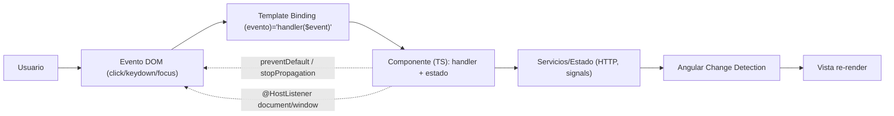

# GestStore - Cliente Web

Bienvenido a la documentación del cliente web de **GestStore**, una aplicación moderna y escalable diseñada para la gestión integral de almacenes y tareas empresariales. Este proyecto forma parte de la solución completa GestStore, interactuando con una API REST basada en Spring Boot.

## 🚀 Descripción del Proyecto

GestStore Web es una Single Page Application (SPA) desarrollada con **Angular 21**, enfocada en ofrecer una experiencia de usuario fluida, modular y altamente mantenible. La arquitectura del proyecto sigue principios de diseño atómico y una estructura de estilos escalable (ITCSS), garantizando que el crecimiento del código no comprometa su calidad.

### Objetivos Principales
- **Gestión de Inventario**: Visualización y control de productos y stock en tiempo real.
- **Administración de Tareas**: Asignación, seguimiento y actualización de estados de tareas.
- **Seguridad**: Autenticación y autorización de usuarios mediante roles.

## 🛠️ Stack Tecnológico

- **Framework**: Angular 21
- **Lenguaje**: TypeScript 5.9
- **Estilos**: SCSS con arquitectura 7-1 (Settings, Tools, Generic, Elements, Objects, Components, Trumps).
- **Diseño de Componentes**: Atomic Design (Átomos, Moléculas, Organismos, Plantillas, Páginas).
- **Testing**: Karma & Jasmine / Vitest (según configuración).

## 📂 Estructura del Proyecto

La estructura del código fuente está organizada para facilitar la escalabilidad:

```text
src/
├── app/
│   ├── components/         # Biblioteca de componentes UI
│   │   ├── atoms/          # Elementos indivisibles (Botones, Badges, Iconos)
│   │   ├── molecules/      # Agrupaciones simples (Alertas, Cards)
│   │   ├── layout/         # Estructura principal (Header, Footer, Main)
│   │   └── shared/         # Componentes reutilizables (Formularios)
│   ├── pages/              # Vistas principales de la aplicación
│   └── ...
├── styles/                 # Arquitectura SCSS global
│   ├── 00-settings/        # Variables y configuración
│   ├── 01-tools/           # Mixins y funciones
│   └── ...
```

## ⚙️ Instalación y Despliegue

### Requisitos Previos
- Node.js (LTS recomendado)
- NPM o Yarn
- Angular CLI (`npm install -g @angular/cli`)

### Pasos para Ejecutar
1.  **Instalar dependencias**:
    ```bash
    npm install
    ```
2.  **Servidor de Desarrollo**:
    ```bash
    ng serve
    ```
    Navega a `http://localhost:4200/`. La aplicación se recargará automáticamente ante cambios.

3.  **Construcción para Producción**:
    ```bash
    ng build
    ```
    Los artefactos de construcción se almacenarán en el directorio `dist/`.

## 🧩 Arquitectura de Eventos y Manipulación del DOM

GestStore está construida como SPA con Angular, por lo que la interacción del usuario se gestiona principalmente mediante **event binding en templates** y handlers en componentes. El objetivo es mantener un flujo claro y predecible: el DOM dispara un evento, el template lo enruta al componente, el componente actualiza estado o llama a servicios, y Angular vuelve a renderizar la vista.

### Flujo de eventos (de extremo a extremo)

1. **Usuario interactúa** con un elemento (click, teclado, foco, hover).
2. El **evento del navegador** llega al DOM.
3. Angular lo captura mediante **bindings** en el template: `(click)`, `(keydown.enter)`, `(keyup)`, `(focus)`, `(blur)`, `(mouseenter)`, `(mouseleave)`, `(ngSubmit)`, etc.
4. Se ejecuta un **handler del componente** (TypeScript), donde:
     - Se valida el evento (por ejemplo, prevenir comportamiento por defecto en formularios).
     - Se controla la propagación cuando hay overlays/menús (`stopPropagation()` en contenido para evitar cierres accidentales).
     - Se actualiza el estado (signals/propiedades) o se llama a servicios (p. ej. creación/consulta de tareas).
5. Angular actualiza el DOM de forma declarativa mediante **data binding** (`{{ }}`, `[class]`, `[attr.*]`, `*ngIf`).
6. Para casos puntuales donde se necesita acceso al DOM nativo (foco, medidas, overlays), se usa **`@ViewChild`/`ElementRef`** y **`Renderer2`** para mantener una manipulación segura.

### Diagrama de flujo de eventos



### Buenas prácticas aplicadas

- **Unidireccionalidad**: la UI dispara eventos, los componentes deciden acciones y el estado resultante vuelve a la vista.
- **Accesibilidad**: los componentes interactivos incorporan roles/atributos ARIA (`aria-expanded`, `aria-controls`, `role="tablist"`, `role="tooltip"`, `aria-modal`) y soporte de teclado.
- **Eventos globales con `@HostListener`**: para comportamientos esperables (cerrar menús con ESC, cerrar por click fuera, responder a resize/scroll).
- **Manipulación del DOM segura**: cuando se necesita crear/posicionar elementos (tooltips, backdrops, indicadores), se usa `Renderer2` y se limpian listeners en `ngOnDestroy`.

### Tabla de componentes y eventos

| Componente/Directiva | Eventos en template | `@HostListener` | DOM/Renderer2 | Propósito |
| --- | --- | --- | --- | --- |
| `HeaderComponent` | `(click)`, `(keydown.enter)` | `document:click`, `document:keydown.escape`, `window:resize` | Backdrop dinámico + clases/atributos | Menú hamburguesa accesible + cierre por click fuera/ESC |
| `DashboardComponent` | `(click)`, `(keydown.enter)` | `document:click`, `document:keydown.escape` | Bloqueo scroll (clase en body) | Modales y acciones del dashboard |
| `AddTaskModalComponent` | `(ngSubmit)`, `(click)` | — | Focus trap + guards creados/eliminados | Modal de alta de tarea con teclado |
| `TooltipDirective` | — (se aplica como atributo) | `window:resize`, `window:scroll`, `keydown.escape` | create/append/remove tooltip | Tooltip con hover y foco |
| `TabsComponent` | `(click)`, `(keydown)` | — | Indicador creado dinámicamente | Pestañas con teclado |
| `AccordionComponent` | `(click)`, `(keydown)` | — | `setStyle(max-height)` animado | Acordeón con teclado |
| `FormInputComponent` | `(input)`, `(focus)`, `(blur)`, `(keyup)` | — | `setStyle/removeStyle` | Inputs con estados de foco |
| `FormTextareaComponent` | `(input)`, `(focus)`, `(blur)`, `(keyup)` | — | `setStyle/removeStyle` | Textarea con estados de foco |
| `FormSelectComponent` | `(change)`, `(focus)`, `(blur)`, `(keydown)` | — | `setStyle/removeStyle` | Select con estados de foco |

### Theme switcher (claro/oscuro)

El tema se controla mediante un servicio global que:

- Detecta la preferencia del sistema con `matchMedia('(prefers-color-scheme: dark)')`.
- Escucha cambios del sistema en tiempo real.
- Persiste la preferencia del usuario en `localStorage`.
- Aplica el modo activo en el atributo `data-theme` del elemento raíz (`<html>`), lo que activa variables CSS en `styles/00-settings/_css-variables.scss`.

## 🌐 Compatibilidad de navegadores (eventos)

Tabla orientativa para navegadores modernos (Desktop/Mobile). En el caso de `matchMedia`, existe fallback para navegadores antiguos que no soportan `addEventListener('change')`.

| Evento/API | Chrome | Edge | Firefox | Safari |
| --- | --- | --- | --- | --- |
| `click`, `input`, `change`, `submit` | 80+ | 80+ | 80+ | 13+ |
| `focus`/`blur`/`focusin`/`focusout` | 80+ | 80+ | 80+ | 13+ |
| `keydown`/`keyup` (incl. `.enter`/`.escape`) | 80+ | 80+ | 80+ | 13+ |
| `mouseenter`/`mouseleave` | 80+ | 80+ | 80+ | 13+ |
| `@HostListener('document:click')` | 80+ | 80+ | 80+ | 13+ |
| `@HostListener('window:resize')` / `window:scroll` | 80+ | 80+ | 80+ | 13+ |
| `matchMedia('(prefers-color-scheme: dark)')` | 76+ | 79+ | 67+ | 12.1+ |
| `MediaQueryList.addEventListener('change')` | 84+ | 84+ | 63+ | 14.1+ |
| Fallback `MediaQueryList.addListener` | — | — | — | Soportado en Safari antiguo |

## 🧪 Calidad y Pruebas

El proyecto incluye una suite de pruebas unitarias y e2e para asegurar la robustez del código.
- Ejecutar tests unitarios: `ng test`

---
