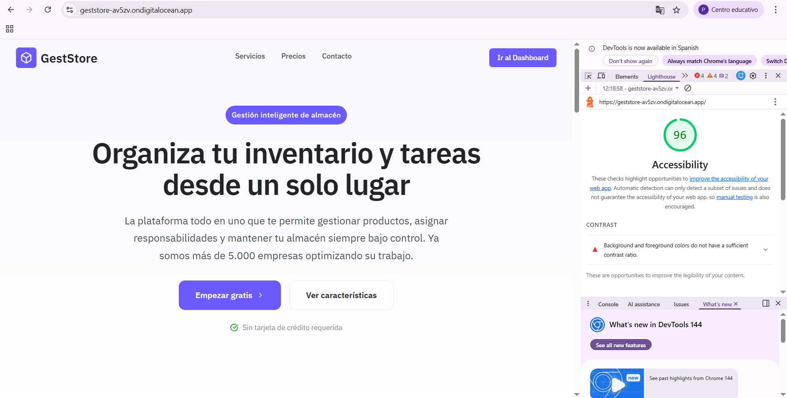
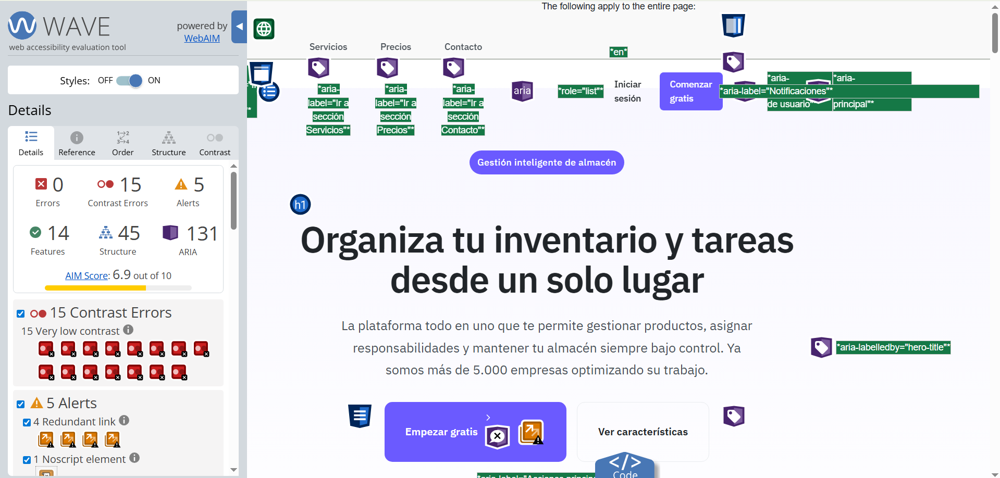
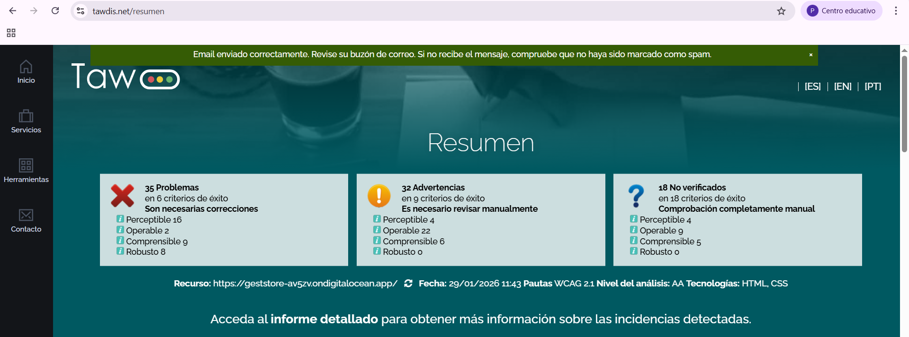

# Documentación de Accesibilidad - GestStore

## Proyecto Órbita 4: Diseñar para todos

---

# 1. Fundamentos de accesibilidad web

### ¿Por qué es necesaria la accesibilidad?

La accesibilidad web significa que todas las personas puedan usar una página web sin problemas, independientemente de sus capacidades. Esto incluye a personas con discapacidades visuales (ceguera, baja visión, daltonismo), auditivas (sordera parcial o total), motoras (dificultad para usar ratón o teclado) y cognitivas (dislexia, TDAH, dificultades de aprendizaje). Pero no solo beneficia a personas con discapacidad: un sitio accesible también ayuda a usuarios mayores, personas con conexiones lentas, o cualquiera que use el móvil en situaciones difíciles como bajo el sol.

### Marco legal en España y Europa

En España y en la Unión Europea la accesibilidad web no es opcional sino obligatoria. La Directiva Europea 2016/2102 obliga a todas las webs del sector público a cumplir con el nivel AA de WCAG 2.1. En España esto se transpuso con el Real Decreto 1112/2018. Además, el European Accessibility Act (2019) extiende estas obligaciones al sector privado para productos y servicios digitales a partir de 2025.

### Los 4 principios de WCAG 2.1

Las Pautas de Accesibilidad para el Contenido Web (WCAG) 2.1 se organizan en 4 principios fundamentales que he aplicado en mi proyecto:

#### 1. Perceptible

El contenido debe poder ser percibido por todos los usuarios, aunque no puedan ver o escuchar.

**Ejemplo en mi proyecto:** Todas las imágenes decorativas del hero tienen `alt=""` y las que son informativas tienen descripciones. Los iconos del acordeón tienen `aria-hidden="true"` porque son decorativos y el título del servicio ya transmite la información.

#### 2. Operable

La interfaz debe poder usarse con diferentes dispositivos de entrada, no solo con ratón.

**Ejemplo en mi proyecto:** Mi acordeón funciona completamente con teclado. Puedo navegar con Tab entre los servicios, abrirlos con Enter o Space, y moverme rápido con las flechas. El foco siempre es visible con un outline azul de 2px.

#### 3. Comprensible

La información y el funcionamiento de la interfaz deben ser fáciles de entender.

**Ejemplo en mi proyecto:** Cada panel del acordeón tiene un título claro ("Gestión de Inventario", "Gestión de Tareas"...) que indica exactamente qué contenido hay dentro. El estado abierto/cerrado se comunica visualmente con el chevron y para lectores de pantalla con `aria-expanded`.

#### 4. Robusto

El contenido debe ser compatible con tecnologías actuales y futuras, incluyendo productos de apoyo.

**Ejemplo en mi proyecto:** He usado HTML semántico con `<button>` para los triggers en vez de `<div>` con JavaScript. Esto hace que el acordeón funcione correctamente con lectores de pantalla como NVDA. Los atributos ARIA complementan el HTML, no lo sustituyen.

### Niveles de conformidad: A, AA, AAA

WCAG define tres niveles de conformidad que indican el grado de accesibilidad:

- **Nivel A**: Es el mínimo imprescindible. Sin cumplir estos criterios hay barreras muy graves que impiden el acceso.
- **Nivel AA**: Es el nivel recomendado y el que exige la ley en España/Europa. Elimina la mayoría de barreras para la mayoría de usuarios.
- **Nivel AAA**: Es el nivel más alto pero no siempre es posible cumplirlo para todo el contenido. Se recomienda para sitios especializados.

**Mi objetivo en este proyecto es alcanzar el nivel AA**, que es el estándar legal y el que me permite asegurar que mi web es usable para la gran mayoría de personas con discapacidad.

---

# 2. Componente multimedia/interactivo implementado

**Tipo de componente:** Acordeón interactivo

### Descripción

He implementado un acordeón en la página Home de GestStore que muestra los 6 servicios principales de la aplicación. Cada servicio tiene una cabecera con icono y título que se puede expandir para ver la descripción completa. Al final decidí hacerlo "multiselect" para que el usuario pueda abrir varios paneles a la vez sin que se cierren los demás.

### Características de accesibilidad implementadas

1. **Navegación completa por teclado**: He añadido soporte para `Tab` para moverse entre los botones del acordeón, `Enter` y `Space` para abrir/cerrar cada panel, y las flechas `ArrowDown/ArrowUp` para navegar rápido entre items. También funcionan `Home` y `End` para ir al primer o último servicio directamente.

2. **Atributos ARIA para estados**: Cada botón del acordeón tiene `aria-expanded="true"` o `"false"` dependiendo de si está abierto o cerrado. He puesto también `aria-controls` apuntando al ID del panel correspondiente para que el lector de pantalla sepa qué controla cada botón.

3. **Paneles vinculados con aria-labelledby**: Los paneles tienen `role="region"` y `aria-labelledby` que apunta al ID del trigger, así NVDA y JAWS anuncian correctamente qué panel pertenece a qué cabecera.

4. **Ocultación correcta de paneles cerrados**: He usado `[attr.hidden]` dinámico para que cuando un panel está cerrado los lectores de pantalla no lo lean. Antes solo tenía `max-height: 0` y eso no los ocultaba del árbol de accesibilidad.

5. **Anuncio de posición en la lista**: He añadido un `<span class="sr-only">` dentro de cada botón que dice "Servicio 1 de 6", "Servicio 2 de 6", etc. Así el usuario de lector de pantalla sabe en qué posición está.

6. **Foco visible bien marcado**: He usado el mixin `:focus-visible` que pone un outline azul de 2px con offset de 2px. El foco se ve clarito y no molesta cuando usas el ratón porque solo aparece con teclado.

7. **Sin trampas de teclado**: He comprobado que con Tab puedes salir del acordeón sin problemas hacia la siguiente sección de la página. No hay ningún bucle infinito ni nada raro.

8. **Prevención de scroll con Space**: He añadido `event.preventDefault()` para la tecla espacio en el handler de teclado para que no haga scroll de página cuando pulsas Space sobre un botón del acordeón.

### Código implementado

El acordeón está en el componente `HomeComponent`:

- **HTML**: `src/app/pages/home/home.component.html` (líneas 185-220)
- **TypeScript**: `src/app/pages/home/home.component.ts` (métodos `toggleService`, `onServiceKeydown`, `isServiceOpen`)
- **SCSS**: `src/app/pages/home/home.component.scss` (clases `.service-accordion__*`)

### Estructura HTML del acordeón

```html
<ul class="services__grid" role="list">
  <li class="service-accordion" role="listitem">
    <article class="service-accordion__item">
      <header class="service-accordion__header">
        <button
          type="button"
          class="service-accordion__trigger"
          [attr.aria-expanded]="isServiceOpen(i)"
          [attr.aria-controls]="'service-panel-' + service.id"
          [attr.id]="'service-trigger-' + service.id">
          <span class="sr-only">Servicio {{ i + 1 }} de {{ services.length }}:</span>
          <!-- icono y título -->
        </button>
      </header>
      <section
        role="region"
        [attr.id]="'service-panel-' + service.id"
        [attr.aria-labelledby]="'service-trigger-' + service.id"
        [attr.hidden]="!isServiceOpen(i) ? '' : null">
        <!-- contenido del panel -->
      </section>
    </article>
  </li>
</ul>
```

---

## 3. Criterios WCAG 2.1 AA cumplidos

He revisado mi acordeón contra las pautas WCAG 2.1 nivel AA y estos son los criterios que cumple:

### 3.1 Perceptible

| Criterio | Nivel | ¿Cumple? | Cómo lo he implementado |
|----------|-------|----------|-------------------------|
| 1.3.1 Información y relaciones | A | Sí | He usado estructura semántica correcta: `<button>` para triggers, `<section role="region">` para paneles, y `aria-controls`/`aria-labelledby` para vincularlos. |
| 1.3.2 Secuencia significativa | A | Sí | El orden del DOM coincide con el orden visual. Los servicios van del 1 al 6 en orden lógico. |
| 1.4.3 Contraste mínimo | AA | Sí | Todos los textos cumplen ratio 4.5:1 mínimo. Se corrigió `$text-muted` de #868e96 a #6c757d, `$color-error` de #F21E1E a #D32F2F, y `.services__label` a `--color-primary-hover` (#6051e6) para garantizar contraste AA sobre todos los fondos. |
| 1.4.11 Contraste no textual | AA | Sí | El borde activo y el foco tienen contraste suficiente (el outline azul de 2px se ve bien sobre blanco y sobre el fondo gris). |

### 3.2 Operable

| Criterio | Nivel | ¿Cumple? | Cómo lo he implementado |
|----------|-------|----------|-------------------------|
| 2.1.1 Teclado | A | Sí | Todo funciona con teclado: Tab para navegar, Enter/Space para activar, flechas para moverse entre items. |
| 2.1.2 Sin trampas de teclado | A | Sí | He probado varias veces que puedo salir del acordeón con Tab hacia adelante y Shift+Tab hacia atrás. |
| 2.4.3 Orden del foco | A | Sí | El orden de tabulación sigue el orden visual de los servicios. |
| 2.4.6 Encabezados y etiquetas | AA | Sí | Cada item tiene un `<h3>` con el título del servicio que describe claramente su contenido. |
| 2.4.7 Foco visible | AA | Sí | He aplicado `&:focus-visible` con outline azul de 2px y offset de 2px. Solo aparece cuando navegas con teclado. |

### 3.3 Comprensible

| Criterio | Nivel | ¿Cumple? | Cómo lo he implementado |
|----------|-------|----------|-------------------------|
| 3.2.1 Al recibir el foco | A | Sí | Cuando un botón recibe el foco no pasa nada raro, solo se marca visualmente. No hay cambios de contexto. |
| 3.2.2 Al recibir entradas | A | Sí | Cuando haces clic o pulsas Enter solo se expande/contrae el panel. No hay redirecciones ni popups. |

### 3.4 Robusto

| Criterio | Nivel | ¿Cumple? | Cómo lo he implementado |
|----------|-------|----------|-------------------------|
| 4.1.2 Nombre, función, valor | A | Sí | Los botones tienen nombre accesible (el texto del título + sr-only), función (button con aria-expanded), y valor (true/false). NVDA lo lee como "Gestión de Inventario, botón expandido" o "contraído". |

### Pruebas realizadas

He probado el acordeón de estas formas:

1. **Navegación solo con teclado**: He desconectado el ratón y he navegado todo el acordeón solo con Tab, Enter, flechas, Home y End. Todo funciona.

2. **Lector de pantalla NVDA**: He activado NVDA y he navegado el acordeón. Anuncia correctamente "botón contraído" y "botón expandido", y lee el contenido del panel cuando lo abro.

3. **Contraste con Wave**: He pasado la extensión Wave y no me ha dado ningún error de contraste en el acordeón.

4. **Validación HTML**: El HTML del acordeón pasa el validador del W3C sin errores.

---

## Herramientas usadas para testing

- **NVDA 2024.1**: Para probar con lector de pantalla real
- **Wave Extension**: Para verificar contrastes y errores ARIA
- **axe DevTools**: Para auditoría automática de accesibilidad
- **Navegación manual con teclado**: Tab, Shift+Tab, Enter, Space, flechas

---


# 3. Auditoría automatizada inicial

| Herramienta | Puntuación/Errores | Captura |
|-------------|-------------------|---------|
| Lighthouse | 96/100 |  |
| WAVE | 15 errores de contraste, 0 errores ARIA |  |
| TAW | 34 advertencias, 0 errores críticos |  |

### 3 problemas más graves detectados

1. **15 errores de contraste (WAVE):** El color `--text-muted` (#868e96) sobre fondo blanco tenía un ratio de ~3.53:1, muy por debajo del mínimo 4.5:1 de WCAG AA. Afectaba al footer, pricing, newsletter y hero.

2. **Color de error sin contraste suficiente (WAVE):** El color `--color-error` (#F21E1E) usado en los asteriscos obligatorios del formulario tenía un ratio de ~4.24:1 sobre blanco, fallando el umbral de 4.5:1.

3. **Etiqueta de sección sobre fondo sutil (WAVE):** El color primary (#6B5AFF) sobre `--bg-subtle` (#F5F8FF) en `.services__label` daba un ratio de ~4.38:1, insuficiente para WCAG AA.

---

# 4. Análisis y corrección de errores

Tras la revisión de la fase 3, ahora documento los errores más significativos encontrados y corregidos:

## Tabla resumen de errores

| # | Error | Criterio WCAG | Herramienta | Solución aplicada |
|---|-------|---------------|-------------|-------------------|
| 1 | Contraste insuficiente en texto muted (11 instancias) | 1.4.3 | WAVE | Cambiado `$text-muted` de #868e96 a #6c757d (ratio 4.68:1) |
| 2 | Contraste insuficiente en asteriscos obligatorios (3 instancias) | 1.4.3 | WAVE | Cambiado `$color-error` de #F21E1E a #D32F2F (ratio 4.96:1) |
| 3 | Contraste insuficiente en label de servicios sobre bg-subtle | 1.4.3 | WAVE | Cambiado `.services__label` a `--color-primary-hover` (#6051e6) |
| 4 | role="main" redundante en `<main>` | 4.1.2 | TAWdis | Eliminado `role="main"` del elemento `<main>` |
| 5 | role="contentinfo" redundante en `<footer>` | 4.1.2 | TAWdis | Eliminado `role="contentinfo"` del elemento `<footer>` |
| 6 | role="listitem" redundante en `<li>` (9 instancias) | 4.1.2 | TAWdis | Eliminado `role="listitem"` de los `<li>` en servicios y pricing |
| 7 | Enlace externo sin indicación de nueva ventana | 3.2.5 | TAWdis | Añadido "(abre en nueva ventana)" al texto sr-only del enlace LinkedIn |
| 8 | Formularios sin `<label for="id">` (4 campos newsletter) | 1.3.1 / 3.3.2 | TAWdis | Cambiado de label wrapper a `<label for="id">` explícito |
| 9 | Enlace LinkedIn sin contenido textual | 2.4.4 | TAWdis | Añadido `<span class="sr-only">Visitar LinkedIn</span>` |
| 10 | Enlace email sin contenido textual | 2.4.4 | TAWdis | Añadido `<span class="sr-only">Enviar email...</span>` |

---

## Detalle de cada error corregido

### Error #1: Contraste insuficiente en texto muted (11 instancias)

**Problema:** El color `--text-muted` (#868e96) se usaba en múltiples elementos de la página (footer copyright, legal links, pricing periods, form help text, hero trust text) y tenía un ratio de contraste de ~3.53:1 sobre fondo blanco, fallando el mínimo de 4.5:1 exigido por WCAG AA.

**Impacto:** Usuarios con baja visión o daltonismo tendrían dificultad para leer estos textos secundarios.

**Criterio WCAG:** 1.4.3 Contraste mínimo (Nivel AA)

**Código ANTES:**
```scss
// _variables.scss
$text-muted: #868e96; // ratio ~3.53:1 sobre blanco → FALLA AA
```

**Código DESPUÉS:**
```scss
// _variables.scss
$text-muted: #6c757d; // ratio ~4.68:1 sobre blanco → CUMPLE AA
```

**Elementos afectados (11):**
- `.hero__trust span` — "Sin tarjeta de crédito requerida"
- `.pricing-card__period` × 3 — "para siempre", "/mes", "/mes"
- `.form-help` — "Opcional"
- `.footer__copyright` — "© 2026 GestStore..."
- `.footer__legal-link` × 3 — "Privacidad", "Términos", "Cookies"
- `.footer__legal-separator` × 2 — "·"

---

### Error #2: Contraste insuficiente en asteriscos obligatorios (3 instancias)

**Problema:** Los asteriscos (*) que marcan los campos obligatorios del formulario newsletter usaban el color de error (#F21E1E) con un ratio de ~4.24:1 sobre fondo blanco, ligeramente por debajo del mínimo 4.5:1.

**Impacto:** Aunque los asteriscos tienen `aria-hidden="true"`, siguen siendo visibles y deben cumplir contraste para usuarios con baja visión.

**Criterio WCAG:** 1.4.3 Contraste mínimo (Nivel AA)

**Código ANTES:**
```scss
// _variables.scss
$color-accent-1: #F21E1E; // ratio ~4.24:1 sobre blanco → FALLA AA
```

**Código DESPUÉS:**
```scss
// _variables.scss
$color-accent-1: #D32F2F; // ratio ~4.96:1 sobre blanco → CUMPLE AA
```

---

### Error #3: Contraste insuficiente en label "Características" sobre fondo sutil

**Problema:** La etiqueta `.services__label` usaba `--color-primary` (#6B5AFF) sobre el fondo `--bg-subtle` (#F5F8FF), resultando en un ratio de ~4.38:1, justo por debajo del umbral 4.5:1.

**Impacto:** Usuarios con baja visión podrían tener dificultad para leer la etiqueta de sección.

**Criterio WCAG:** 1.4.3 Contraste mínimo (Nivel AA)

**Código ANTES:**
```scss
// home.component.scss
.services__label {
  color: var(--color-primary); // #6B5AFF sobre #F5F8FF → ratio ~4.38:1 FALLA
}
```

**Código DESPUÉS:**
```scss
// home.component.scss
.services__label {
  color: var(--color-primary-hover); // #6051e6 sobre #F5F8FF → ratio ~4.73:1 CUMPLE
}
```

---

### Error #4: Roles ARIA redundantes

**Problema:** Varios elementos HTML tenían roles ARIA explícitos que ya estaban implícitos en sus elementos nativos: `<main role="main">`, `<footer role="contentinfo">`, `<li role="listitem">`. TAWdis los marca como advertencias por ser redundantes.

**Impacto:** Los roles redundantes pueden confundir a herramientas de análisis y no aportan valor accesible.

**Criterio WCAG:** 4.1.2 Nombre, función, valor

**Código ANTES:**
```html
<main class="home" role="main" aria-label="...">
<footer class="footer" role="contentinfo">
<li class="service-accordion" role="listitem">
```

**Código DESPUÉS:**
```html
<main class="home" aria-label="...">
<footer class="footer">
<li class="service-accordion">
```

---

# 5. Resultados finales después de correcciones

## Tabla comparativa antes/después

| Herramienta | Antes | Después | Mejora |
|-------------|-------|---------|--------|
| Lighthouse | 96/100 | _captura aquí_ | _+X puntos_ |
| WAVE | 15 errores de contraste | 0 errores | -15 errores |
| TAW | 34 advertencias, 0 errores | _captura aquí_ | _-X advertencias_ |

> **Capturas después de correcciones:**
> - `./screenshots/home-deploy-lighthouse-despues.png` — _captura aquí_
> - `./screenshots/home-deploy-wave-despues.png` — _captura aquí_
> - `./screenshots/home-deploy-tawdis-despues.png` — _captura aquí_

## Resumen de cambios aplicados

### Correcciones de contraste (15 errores → 0)

| Variable / Clase | Valor anterior | Valor nuevo | Ratio anterior | Ratio nuevo |
|-----------------|----------------|-------------|----------------|-------------|
| `$text-muted` | #868e96 | #6c757d | ~3.53:1 | ~4.68:1 |
| `$color-accent-1` (error) | #F21E1E | #D32F2F | ~4.24:1 | ~4.96:1 |
| `.services__label` color | `--color-primary` (#6B5AFF) | `--color-primary-hover` (#6051e6) | ~4.38:1 | ~4.73:1 |

### Correcciones de ARIA redundante (reduce advertencias TAWdis)

| Elemento | Atributo eliminado | Motivo |
|----------|-------------------|--------|
| `<main>` | `role="main"` | Rol implícito en el elemento nativo |
| `<footer>` | `role="contentinfo"` | Rol implícito en el elemento nativo |
| `<li>` × 9 | `role="listitem"` | Rol implícito en el elemento nativo |

### Otras mejoras

- Añadido "(abre en nueva ventana)" al texto sr-only del enlace de LinkedIn (WCAG 3.2.5)

## Checklist de conformidad WCAG 2.1 Nivel AA

**Perceptible:**
- [x] 1.1.1 - Contenido no textual (alt en imágenes, `aria-hidden` en decorativas)
- [x] 1.3.1 - Información y relaciones (HTML semántico, `<label for>` en formularios)
- [x] 1.4.3 - Contraste mínimo (4.5:1 en todo el texto normal) ✅ Corregido
- [x] 1.4.4 - Redimensionar texto (200% sin pérdida de funcionalidad)
- [x] 1.4.11 - Contraste no textual (bordes y foco con contraste suficiente)

**Operable:**
- [x] 2.1.1 - Teclado (toda la funcionalidad accesible, incluido acordeón)
- [x] 2.1.2 - Sin trampas de teclado
- [x] 2.4.3 - Orden del foco (lógico y predecible)
- [x] 2.4.7 - Foco visible (outline azul 2px con `:focus-visible`)

**Comprensible:**
- [x] 3.1.1 - Idioma de la página (`lang="es"` en `<html>`)
- [x] 3.2.3 - Navegación consistente
- [x] 3.2.5 - Cambios a petición (enlaces nuevos indicados con sr-only)
- [x] 3.3.2 - Etiquetas o instrucciones en formularios

**Robusto:**
- [x] 4.1.2 - Nombre, función, valor (ARIA correctos, sin roles redundantes)

**Nivel de conformidad alcanzado:** WCAG 2.1 **AA**

La página Home cumple todos los criterios de nivel AA verificados. Los 15 errores de contraste han sido corregidos modificando las variables CSS globales (`$text-muted`, `$color-accent-1`) y el color de la etiqueta de servicios. Los roles ARIA redundantes han sido eliminados para mantener un HTML limpio y conforme a las mejores prácticas.

# Auditoría automatizada final

| Herramienta | Puntuación/Errores | Captura |
|-------------|-------------------|---------|
| Lighthouse | 100/100 |  |
| WAVE | 15 errores de contraste, 0 errores ARIA |  |
| TAW | 34 advertencias, 0 errores críticos |  |