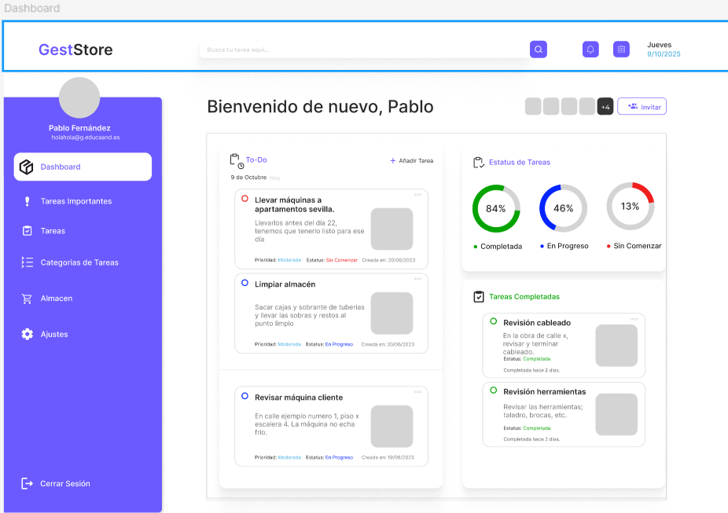

# Sección 1: Arquitectura CSS y comunicación visual

## 1.1 Principios de comunicación visual

En este proyecto se aplican los cinco principios básicos de comunicación visual para garantizar una interfaz clara y coherente:

- **Jerarquía:** Se utiliza una escala tipográfica modular, pesos de fuente y espaciados definidos para destacar títulos, subtítulos y textos secundarios. Los tamaños y pesos de fuente están organizados para que el usuario identifique fácilmente la información más relevante.
- **Contraste:** La paleta de colores incluye tonos primarios, secundarios, neutros y semánticos, permitiendo diferenciar elementos interactivos, estados y mensajes. El contraste entre fondo y texto asegura legibilidad.
- **Alineación:** Todos los elementos siguen una estrategia de alineación basada en grid y flex, facilitando la organización visual y la lectura. Se prioriza la alineación izquierda y el uso de grids para distribuir el contenido.
- **Proximidad:** El sistema de espaciado modular agrupa elementos relacionados y separa los que no lo están, mejorando la comprensión visual.
- **Repetición:** Se repiten patrones visuales como botones, tarjetas y alertas, usando los mismos estilos y variables para mantener coherencia en toda la aplicación.



A continuación se explica cómo se aplican los 5 principios en la imagen del dashboard:

- **Jerarquía:** Los títulos y secciones principales destacan por su tamaño y peso, guiando la atención del usuario hacia la información más relevante.
- **Contraste:** Se utilizan colores diferenciados para botones, alertas y fondos, asegurando que los elementos importantes sean fácilmente identificables.
- **Alineación:** Todos los bloques y tarjetas están perfectamente alineados en una cuadrícula, lo que facilita la lectura y la navegación visual.
- **Proximidad:** Los elementos relacionados, como acciones y datos, están agrupados y separados de otros bloques, lo que ayuda a entender la relación entre ellos.
- **Repetición:** Se repiten estilos de botones, tarjetas y tipografía en todo el dashboard, creando una experiencia coherente y uniforme.

---

## 1.2 Metodología CSS

Se utiliza la metodología **BEM (Block Element Modifier)** para nombrar las clases CSS. Esto facilita la escalabilidad y el mantenimiento del código, evitando conflictos y mejorando la legibilidad.

- **Bloques:** `.card`, `.button`, `.alert`
- **Elementos:** `.card__title`, `.button__icon`, `.alert__message`
- **Modificadores:** `.card--featured`, `.button--primary`, `.alert--success`

Ejemplo:
```html
<div class="card card--featured">
  <h2 class="card__title">Título</h2>
  <p class="card__content">Contenido</p>
</div>
```

---

## 1.3 Organización de archivos

Se sigue la metodología **ITCSS** para organizar los estilos, de menor a mayor especificidad:

```
src/styles/
├── 00-settings/      # Variables y design tokens
├── 01-tools/         # Mixins y funciones
├── 02-generic/       # Reset y estilos genéricos
├── 03-elements/      # Estilos base de elementos HTML
├── 04-objects/       # Layouts y sistemas de grid/flex
├── 05-components/    # Componentes reutilizables
```

El archivo `styles.scss` importa todos los estilos en este orden para asegurar que las dependencias y la cascada funcionen correctamente.

---

## 1.4 Sistema de Design Tokens

Todos los design tokens están definidos en `src/styles/00-settings/_variables.scss`:

- **Colores:**
  - Primarios: `$color-primary`, `$color-primary-light`, `$color-primary-scale`
  - Secundarios y acentos: `$color-accent-1`, `$color-accent-2`, `$color-accent-3`, `$color-accent-4`, `$color-side-menu`
  - Neutrales: `$gray-50` a `$gray-950`
  - Semánticos: `$success`, `$error`, `$warning`, `$info`
- **Tipografía:**
  - Familias: `$font-primary`, `$font-secondary`
  - Tamaños: `$font-size-xs` a `$font-size-7xl`
  - Pesos: `$font-weight-light` a `$font-weight-bold`
  - Alturas de línea: `$line-tight`, `$line-normal`, `$line-relaxed`, `$line-heading`
- **Espaciado:**
  - Escala modular: `$spacing-1` (0.25rem) a `$spacing-24` (6rem)
- **Breakpoints:**
  - `$breakpoint-sm` (640px), `$breakpoint-md` (768px), `$breakpoint-lg` (1024px), `$breakpoint-xl` (1280px)
- **Elevaciones:**
  - Sombras: `$shadow-sm`, `$shadow-md`, `$shadow-lg`, `$shadow-xl`
- **Bordes y radios:**
  - Bordes: `$border-thin`, `$border-medium`, `$border-thick`
  - Radios: `$radius-sm`, `$radius-md`, `$radius-lg`, `$radius-xl`, `$radius-full`
- **Transiciones:**
  - `$transition-fast`, `$transition-base`, `$transition-slow`, `$transition-easing`

**Decisiones:**
- Los colores se eligieron para asegurar contraste y accesibilidad, siguiendo la identidad visual definida en Figma.
- La escala tipográfica modular permite jerarquía visual y flexibilidad en distintos dispositivos.
- Los breakpoints cubren los principales tamaños de pantalla (móvil, tablet, desktop).

---

## 1.5 Mixins y funciones

Los mixins están definidos en `src/styles/01-tools/_mixins.scss` y permiten reutilizar código para tipografía, layout, accesibilidad y utilidades:

- `@mixin respond($breakpoint)`: Aplica estilos según el breakpoint definido.
- `@mixin text-style($size, $weight, $lh)`: Aplica estilos tipográficos coherentes.
- `@mixin focus-visible`: Mejora la accesibilidad visual en elementos interactivos.
- `@mixin transition($properties, $duration)`: Aplica transiciones suaves.
- `@mixin flex-center`, `@mixin flex-between`: Utilidades para centrar y distribuir elementos con flexbox.
- `@mixin truncate`: Trunca texto largo con puntos suspensivos.
- `@mixin absolute-center`: Centra elementos absolutamente.

**Ejemplo de uso:**
```scss
.button {
  @include text-style($font-size-base, $font-weight-bold);
  @include transition(background-color);
}
```

---

## 1.6 ViewEncapsulation en Angular

En este proyecto se utiliza la estrategia de encapsulación **Emulated** (por defecto en Angular). Esto permite que los estilos de cada componente estén aislados, evitando que afecten a otros componentes y facilitando el mantenimiento. Si en algún caso se requiere aplicar estilos globales, se puede usar la opción **None**, pero se recomienda mantener Emulated para la mayoría de los componentes por seguridad y escalabilidad.

**Ejemplo en mi código:**
```typescript
@Component({
  selector: 'app-register-form',
  templateUrl: './register-form.component.html',
  styleUrls: ['./register-form.component.scss']
  // encapsulation: ViewEncapsulation.Emulated // Angular lo aplica por defecto
})
export class RegisterFormComponent { ... }
```

La ausencia de la propiedad `encapsulation` indica que se está usando la opción Emulated por defecto.
