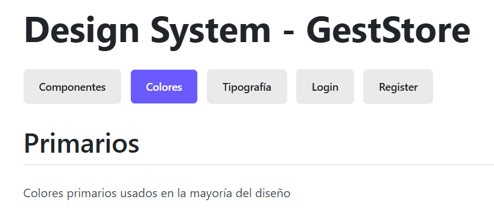
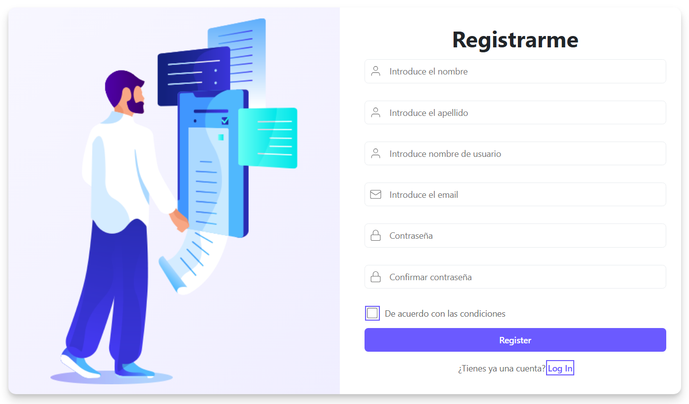

# Fase 1: Fundamentos y Arquitectura CSS

## 1.1 Principios de comunicación visual

En este proyecto se aplican los cinco principios básicos de comunicación visual para garantizar una interfaz clara y coherente:

- **Jerarquía:** Se utiliza una escala tipográfica modular, pesos de fuente y espaciados definidos para destacar títulos, subtítulos y textos secundarios. Los tamaños y pesos de fuente están organizados para que el usuario identifique fácilmente la información más relevante.
- **Contraste:** La paleta de colores incluye tonos primarios, secundarios, neutros y semánticos, permitiendo diferenciar elementos interactivos, estados y mensajes. El contraste entre fondo y texto asegura legibilidad.
- **Alineación:** Todos los elementos siguen una estrategia de alineación basada en grid y flex, facilitando la organización visual y la lectura. Se prioriza la alineación izquierda y el uso de grids para distribuir el contenido.
- **Proximidad:** El sistema de espaciado modular agrupa elementos relacionados y separa los que no lo están, mejorando la comprensión visual.
- **Repetición:** Se repiten patrones visuales como botones, tarjetas y alertas, usando los mismos estilos y variables para mantener coherencia en toda la aplicación.


A continuación se explica cómo se aplican los 5 principios en la imagen del dashboard:

- **Jerarquía:** Los títulos y secciones principales destacan por su tamaño y peso, guiando la atención del usuario hacia la información más relevante.
- **Contraste:** Se utilizan colores diferenciados para botones, alertas y fondos, asegurando que los elementos importantes sean fácilmente identificables.
- **Alineación:** Todos los bloques y tarjetas están perfectamente alineados en una cuadrícula, lo que facilita la lectura y la navegación visual.
- **Proximidad:** Los elementos relacionados, como acciones y datos, están agrupados y separados de otros bloques, lo que ayuda a entender la relación entre ellos.
- **Repetición:** Se repiten estilos de botones, tarjetas y tipografía en todo el dashboard, creando una experiencia coherente y uniforme.

---

## 1.2 Metodología CSS

Se utiliza la metodología **BEM (Block Element Modifier)** para nombrar las clases CSS. Esto facilita la escalabilidad y el mantenimiento del código, evitando conflictos y mejorando la legibilidad.

- **Bloques:** `.card`, `.button`, `.alert`
- **Elementos:** `.card__title`, `.button__icon`, `.alert__message`
- **Modificadores:** `.card--featured`, `.button--primary`, `.alert--success`

Ejemplo:
```html
<div class="card card--featured">
  <h2 class="card__title">Título</h2>
  <p class="card__content">Contenido</p>
</div>
```

---

## 1.3 Organización de archivos

Se sigue la metodología **ITCSS** para organizar los estilos, de menor a mayor especificidad:

```
src/styles/
├── 00-settings/      # Variables y design tokens
├── 01-tools/         # Mixins y funciones
├── 02-generic/       # Reset y estilos genéricos
├── 03-elements/      # Estilos base de elementos HTML
├── 04-objects/       # Layouts y sistemas de grid/flex
├── 05-components/    # Componentes reutilizables
```

El archivo `styles.scss` importa todos los estilos en este orden para asegurar que las dependencias y la cascada funcionen correctamente.

---

## 1.4 Sistema de Design Tokens

Todos los design tokens están definidos en `src/styles/00-settings/_variables.scss`:

- **Colores:**
  - Primarios: `$color-primary`, `$color-primary-light`, `$color-primary-scale`
  - Secundarios y acentos: `$color-accent-1`, `$color-accent-2`, `$color-accent-3`, `$color-accent-4`, `$color-side-menu`
  - Neutrales: `$gray-50` a `$gray-950`
  - Semánticos: `$success`, `$error`, `$warning`, `$info`
- **Tipografía:**
  - Familias: `$font-primary`, `$font-secondary`
  - Tamaños: `$font-size-xs` a `$font-size-7xl`
  - Pesos: `$font-weight-light` a `$font-weight-bold`
  - Alturas de línea: `$line-tight`, `$line-normal`, `$line-relaxed`, `$line-heading`
- **Espaciado:**
  - Escala modular: `$spacing-1` (0.25rem) a `$spacing-24` (6rem)
- **Breakpoints:**
  - `$breakpoint-sm` (640px), `$breakpoint-md` (768px), `$breakpoint-lg` (1024px), `$breakpoint-xl` (1280px)
- **Elevaciones:**
  - Sombras: `$shadow-sm`, `$shadow-md`, `$shadow-lg`, `$shadow-xl`
- **Bordes y radios:**
  - Bordes: `$border-thin`, `$border-medium`, `$border-thick`
  - Radios: `$radius-sm`, `$radius-md`, `$radius-lg`, `$radius-xl`, `$radius-full`
- **Transiciones:**
  - `$transition-fast`, `$transition-base`, `$transition-slow`, `$transition-easing`

**Decisiones:**
- Los colores se eligieron para asegurar contraste y accesibilidad, siguiendo la identidad visual definida en Figma.
- La escala tipográfica modular permite jerarquía visual y flexibilidad en distintos dispositivos.
- Los breakpoints cubren los principales tamaños de pantalla (móvil, tablet, desktop).

---

## 1.5 Mixins y funciones

Los mixins están definidos en `src/styles/01-tools/_mixins.scss` y permiten reutilizar código para tipografía, layout, accesibilidad y utilidades:

- `@mixin respond($breakpoint)`: Aplica estilos según el breakpoint definido.
- `@mixin text-style($size, $weight, $lh)`: Aplica estilos tipográficos coherentes.
- `@mixin focus-visible`: Mejora la accesibilidad visual en elementos interactivos.
- `@mixin transition($properties, $duration)`: Aplica transiciones suaves.
- `@mixin flex-center`, `@mixin flex-between`: Utilidades para centrar y distribuir elementos con flexbox.
- `@mixin truncate`: Trunca texto largo con puntos suspensivos.
- `@mixin absolute-center`: Centra elementos absolutamente.

**Ejemplo de uso:**
```scss
.button {
  @include text-style($font-size-base, $font-weight-bold);
  @include transition(background-color);
}
```

---

## 1.6 ViewEncapsulation en Angular

En este proyecto se utiliza la estrategia de encapsulación **Emulated** (por defecto en Angular). Esto permite que los estilos de cada componente estén aislados, evitando que afecten a otros componentes y facilitando el mantenimiento. Si en algún caso se requiere aplicar estilos globales, se puede usar la opción **None**, pero se recomienda mantener Emulated para la mayoría de los componentes por seguridad y escalabilidad.

**Ejemplo en mi código:**
```typescript
@Component({
  selector: 'app-register-form',
  templateUrl: './register-form.component.html',
  styleUrls: ['./register-form.component.scss']
  // encapsulation: ViewEncapsulation.Emulated // Angular lo aplica por defecto
})
export class RegisterFormComponent { ... }
```

La ausencia de la propiedad `encapsulation` indica que se está usando la opción Emulated por defecto.


---

# Fase 2: HTML semántico y componentes de Layout

## 2.1 Elementos semánticos utilizados

En la aplicación se emplean los siguientes elementos semánticos para estructurar el contenido:

- `<header>`: Encabezado principal, contiene el logo, navegación y acciones de usuario.
- `<nav>`: Navegación principal y secundaria.
- `<main>`: Contenedor del contenido principal de cada página.
- `<section>`: Agrupa bloques de contenido relacionados, como enlaces legales o redes sociales en el footer.
- `<footer>`: Pie de página con información legal y de contacto.
- `<form>`: Para formularios de login y registro.
- `<fieldset>` y `<legend>`: Para agrupar y describir campos relacionados en formularios.
- `<aside>`: Opcional, para contenido secundario si el diseño lo requiere.

**Ejemplo de código:**
```html
<header class="app-header">
  <nav> ... </nav>
</header>
<main class="app-main">
  <section> ... </section>
</main>
<footer class="app-footer">
  <section> ... </section>
</footer>
```

---

## 2.2 Jerarquía de headings

La estrategia de headings sigue estas reglas:
- Solo un `<h1>` por página, para el título principal.
- `<h2>` para secciones principales.
- `<h3>` para subsecciones.
- Nunca se saltan niveles.

**Diagrama de jerarquía:**
```
h1: Título principal de la página
  └─ h2: Sección principal
      └─ h3: Subsección
```



---

## 2.3 Estructura de formularios

Los formularios usan `<form>`, `<fieldset>`, `<legend>`, y el componente `form-input` para cada campo. Los labels están correctamente asociados a los inputs mediante `for` e `id`.

**Ejemplo de código de form-input:**
```html
<form class="register-modal__form" (ngSubmit)="onSubmit($event)">
    <fieldset>
    <legend>Datos de registro</legend>
    <div class="form-group">
        <input type="text" 
                class="form-input form-input--with-icon" 
                placeholder="Introduce el nombre"
                [(ngModel)]="nombre"
                name="nombre"
                [class.form-input--error]="errors['nombre']">
        <svg class="form-input__icon" viewBox="0 0 24 24" fill="none" stroke="currentColor">
        <path d="M20 21v-2a4 4 0 0 0-4-4H8a4 4 0 0 0-4 4v2M12 3a4 4 0 1 0 0 8 4 4 0 0 0 0-8z"/>
        </svg>
        @if (errors['nombre']) {
        <p class="form-error">{{ errors['nombre'] }}</p>
        }
    </div>

```



---

**Fase 2 completada:**
- Componentes de layout semánticos y reutilizables.
- Componente form-input funcional y accesible.
- Formularios estructurados y completos.
- Estilos SCSS siguiendo BEM y usando variables.
- Custom Properties CSS para temas.
- Documentación ampliada en este archivo.

---

# Fase 3: Componentes UI Básicos

## 3.1 Componentes implementados

En esta fase se han desarrollado **9 componentes UI** fundamentales que forman la base del sistema de diseño. Todos siguen la arquitectura de componentes standalone de Angular con soporte para TypeScript, SCSS y accesibilidad.

### Componentes Obligatorios (5/5)

#### **Button** (`src/app/components/atoms/button/`)
Componente de botón interactivo con múltiples variantes y estados.

**Variantes:** Primary, Secondary, Tertiary, Success, Error, Warning
**Tamaños:** Small (28px), Medium (40px, default), Large (48px)
**Estados:** Normal, Hover, Active, Disabled, Full-width

**Código  del componente TypeScript:**
```typescript
import { Component, Input } from '@angular/core';
import { CommonModule } from '@angular/common';

export type ButtonVariant = 'primary' | 'secondary' | 'tertiary' | 'danger' | 'success' | 'warning';
export type ButtonSize = 'small' | 'medium' | 'large';

@Component({
  selector: 'app-button',
  standalone: true,
  imports: [CommonModule],
  template: `
    <button 
      [class]="getButtonClasses()"
      [disabled]="disabled"
      (click)="onClick()">
      <ng-content></ng-content>
    </button>
  `,
  styleUrl: './button.component.scss'
})
export class ButtonComponent {
  @Input() variant: ButtonVariant = 'primary';
  @Input() size: ButtonSize = 'medium';
  @Input() disabled: boolean = false;
  @Input() fullWidth: boolean = false;

  getButtonClasses(): string {
    return `button button--${this.variant} button--${this.size} ${this.fullWidth ? 'button--full-width' : ''}`;
  }

  onClick(): void {
    // lógica personalizada
  }
}
```

**Uso en template:**
```html
<app-button variant="primary">Botón Primario</app-button>
<app-button variant="secondary" size="small">Pequeño</app-button>
<app-button variant="error" [disabled]="true">Deshabilitado</app-button>
<app-button variant="success" [fullWidth]="true">Ancho Completo</app-button>
```

**Nomenclatura BEM:**
```scss
.button {                      // Bloque
  &--primary { }               // Modificador: variante
  &--small { }                 // Modificador: tamaño
  &:disabled { }               // Modificador: estado
  &--full-width { }            // Modificador: ancho
}
```

---

#### **Card** (`src/app/components/molecules/card/`)
Componente contenedor para agrupar contenido relacionado.

**Sombras:** Small, Medium, Large
**Propiedades:** Titulo configurable, contenido flexible, efecto hover opcional

**Código  del componente TypeScript:**
```typescript
import { Component, Input } from '@angular/core';
import { CommonModule } from '@angular/common';

@Component({
  selector: 'app-card',
  standalone: true,
  imports: [CommonModule],
  template: `
    <div [class]="getCardClasses()">
      <div *ngIf="title" class="card__header">
        <h3 class="card__title">{{ title }}</h3>
      </div>
      <div class="card__body">
        <ng-content></ng-content>
      </div>
      <div *ngIf="footer" class="card__footer">
        <ng-content select="[card-footer]"></ng-content>
      </div>
    </div>
  `,
  styleUrl: './card.component.scss'
})
export class CardComponent {
  @Input() title: string = '';
  @Input() footer: boolean = false;
  @Input() hoverable: boolean = true;
  @Input() shadow: 'small' | 'medium' | 'large' = 'medium';

  getCardClasses(): string {
    return `card card--shadow-${this.shadow} ${this.hoverable ? 'card--hoverable' : ''}`;
  }
}
```

**Uso en template:**
```html
<app-card shadow="medium" title="Título de tarjeta">
  <p>Contenido de la tarjeta</p>
</app-card>

<app-card shadow="large" title="Tarjeta Destacada">
  <ul>
    <li>Item 1</li>
    <li>Item 2</li>
  </ul>
</app-card>
```

**Nomenclatura BEM:**
```scss
.card {                        // Bloque
  &--shadow-small { }          // Modificador: sombra
  &--shadow-medium { }         // Modificador: sombra
  &__title { }                 // Elemento: título
  &__content { }               // Elemento: contenido
  &:hover { }                  // Modificador: interacción
}
```

---

#### **Alert** (`src/app/components/molecules/alert/`)
Componente de retroalimentación con ícono y mensaje para notificaciones.

**Tipos:** Success (verde), Error (rojo), Warning (amarillo), Info (azul)
**Características:** Icono automático según tipo, colores semánticos, accesible

**Código  del componente TypeScript (parcial):**
```typescript
import { Component, Input } from '@angular/core';
import { CommonModule } from '@angular/common';

export type AlertType = 'success' | 'warning' | 'error' | 'info';

@Component({
  selector: 'app-alert',
  standalone: true,
  imports: [CommonModule],
  template: `
    <div [class]="getAlertClasses()" role="alert">
      <div class="alert__icon">
        <svg class="alert__icon-svg" viewBox="0 0 24 24" fill="none" stroke="currentColor">
          <!-- SVG dinámico según tipo -->
        </svg>
      </div>
      <div class="alert__content">
        <ng-content></ng-content>
      </div>
    </div>
  `,
  styleUrl: './alert.component.scss'
})
export class AlertComponent {
  @Input() type: AlertType = 'info';

  getAlertClasses(): string {
    return `alert alert--${this.type}`;
  }
}
```

**Uso en template:**
```html
<app-alert type="success">¡Operación completada exitosamente!</app-alert>
<app-alert type="error">Error: No se pudo procesar la solicitud</app-alert>
<app-alert type="warning">Advertencia: Revisa los datos antes de continuar</app-alert>
<app-alert type="info">Información: Esta acción es irreversible</app-alert>
```

**Nomenclatura BEM:**
```scss
.alert {                       // Bloque
  &--success { }               // Modificador: tipo
  &--error { }                 // Modificador: tipo
  &__icon { }                  // Elemento: ícono
  &__message { }               // Elemento: mensaje
}
```

---

#### **Form Input** (`src/app/components/shared/form-input/`)
Campo de entrada de texto con label, validación y ayuda contextual.

**Tipos:** text, email, password, number, etc.
**Estados:** Normal, Focus, Disabled, Error, Con ayuda
**Propiedades:** Label, placeholder, required, disabled, error, helpText

**Código  del componente TypeScript:**
```typescript
import { Component, Input, Output, EventEmitter } from '@angular/core';
import { CommonModule } from '@angular/common';
import { FormsModule } from '@angular/forms';

@Component({
  selector: 'app-form-input',
  standalone: true,
  imports: [CommonModule, FormsModule],
  templateUrl: './form-input.component.html',
  styleUrls: ['./form-input.component.scss']
})
export class FormInputComponent {
  @Input() id: string = '';
  @Input() name: string = '';
  @Input() label: string = '';
  @Input() type: string = 'text';
  @Input() placeholder: string = '';
  @Input() required: boolean = false;
  @Input() disabled: boolean = false;
  @Input() value: string = '';
  @Input() error: string = '';
  @Input() helpText: string = '';
  
  @Output() valueChange = new EventEmitter<string>();

  onInput(event: any): void {
    const newValue = event.target.value;
    this.value = newValue;
    this.valueChange.emit(newValue);
  }
}
```

**HTML  del componente:**
```html
<div class="form-group">
  <label [for]="id" class="form-label" *ngIf="label">
    {{ label }}
    <span class="required" *ngIf="required" aria-label="requerido">*</span>
  </label>
  
  <input
    [id]="id"
    [name]="name"
    [type]="type"
    [placeholder]="placeholder"
    [required]="required"
    [disabled]="disabled"
    [value]="value"
    [class.form-input--error]="error"
    class="form-input"
    (input)="onInput($event)"
    aria-describedby="help-text error-text"
  />

  <p class="form-help" id="help-text" *ngIf="helpText">{{ helpText }}</p>
  <p class="form-error" id="error-text" *ngIf="error" role="alert">{{ error }}</p>
</div>
```

**Uso en template del proyecto:**
```html
<app-form-input 
  id="form-email"
  name="email"
  label="Correo Electrónico" 
  type="email"
  placeholder="ejemplo@correo.com"
  required="true"
  (valueChange)="onEmailChange($event)"
/>

<app-form-input 
  id="form-password"
  name="password"
  label="Contraseña" 
  type="password"
  [helpText]="'Mínimo 8 caracteres'"
/>
```

**Nomenclatura BEM:**
```scss
.form-input {                  // Bloque
  &__label { }                 // Elemento: etiqueta
  &__input { }                 // Elemento: campo
  &__help-text { }             // Elemento: ayuda
  &__error { }                 // Elemento: error
  &--disabled { }              // Modificador: estado
  &--error { }                 // Modificador: estado
  &:focus { }                  // Pseudoclase: interacción
}
```

---

#### **Form Textarea** (`src/app/components/shared/form-textarea/`)
Área de texto para entradas multilinea con validación y soporte de filas personalizadas.

**Estados:** Normal, Focus, Disabled, Error, Con ayuda
**Propiedades:** Label, placeholder, required, disabled, error, helpText, rows

**Código  del componente TypeScript:**
```typescript
import { Component, Input, Output, EventEmitter } from '@angular/core';
import { CommonModule } from '@angular/common';
import { FormsModule } from '@angular/forms';

@Component({
  selector: 'app-form-textarea',
  standalone: true,
  imports: [CommonModule, FormsModule],
  templateUrl: './form-textarea.component.html',
  styleUrls: ['./form-textarea.component.scss']
})
export class FormTextareaComponent {
  @Input() id: string = '';
  @Input() name: string = '';
  @Input() label: string = '';
  @Input() placeholder: string = '';
  @Input() required: boolean = false;
  @Input() disabled: boolean = false;
  @Input() value: string = '';
  @Input() error: string = '';
  @Input() helpText: string = '';
  @Input() rows: number = 4;
  
  @Output() valueChange = new EventEmitter<string>();

  onInput(event: any): void {
    const newValue = event.target.value;
    this.value = newValue;
    this.valueChange.emit(newValue);
  }
}
```

**HTML  del componente:**
```html
<div class="form-group">
  <label [for]="id" class="form-label" *ngIf="label">
    {{ label }}
    <span class="required" *ngIf="required" aria-label="requerido">*</span>
  </label>
  
  <textarea
    [id]="id"
    [name]="name"
    [placeholder]="placeholder"
    [required]="required"
    [disabled]="disabled"
    [value]="value"
    [rows]="rows"
    [class.form-textarea--error]="error"
    class="form-textarea"
    (input)="onInput($event)"
    aria-describedby="help-text error-text"
  ></textarea>

  <p class="form-help" id="help-text" *ngIf="helpText">{{ helpText }}</p>
  <p class="form-error" id="error-text" *ngIf="error" role="alert">{{ error }}</p>
</div>
```

**Uso en template del proyecto:**
```html
<app-form-textarea 
  id="form-description"
  name="description"
  label="Descripción" 
  placeholder="Ingresa una descripción..."
  [rows]="5"
  required
  (valueChange)="onDescriptionChange($event)"
/>

<app-form-textarea 
  id="form-comments"
  name="comments"
  label="Comentarios"
  [rows]="3"
  [helpText]="'Máximo 500 caracteres'"
/>
```

**Nomenclatura BEM:**
```scss
.form-textarea {               // Bloque
  &__label { }                 // Elemento: etiqueta
  &__textarea { }              // Elemento: campo
  &__help-text { }             // Elemento: ayuda
  &--error { }                 // Modificador: estado
}
```

---

#### **Form Select** (`src/app/components/shared/form-select/`)
Dropdown con opciones tipadas para selecciones predefinidas.

**Estados:** Normal, Focus, Disabled, Open, Cerrado
**Propiedades:** Label, options (SelectOption[]), placeholder, required, disabled

**Interfaz y Componente TypeScript :**
```typescript
import { Component, Input, Output, EventEmitter } from '@angular/core';
import { CommonModule } from '@angular/common';

export interface SelectOption {
  value: string | number;
  label: string;
  disabled?: boolean;
}

@Component({
  selector: 'app-form-select',
  standalone: true,
  imports: [CommonModule],
  templateUrl: './form-select.component.html',
  styleUrls: ['./form-select.component.scss']
})
export class FormSelectComponent {
  @Input() id: string = '';
  @Input() name: string = '';
  @Input() label: string = '';
  @Input() options: SelectOption[] = [];
  @Input() placeholder: string = '';
  @Input() required: boolean = false;
  @Input() disabled: boolean = false;
  @Input() value: string | number = '';
  @Input() error: string = '';
  @Input() helpText: string = '';
  
  @Output() valueChange = new EventEmitter<string | number>();

  onChange(event: any): void {
    const newValue = event.target.value;
    this.value = newValue;
    this.valueChange.emit(newValue);
  }
}
```

**Uso en template del proyecto:**
```typescript
// En el componente del padre
selectOptions: SelectOption[] = [
  { value: 'es', label: 'España' },
  { value: 'mx', label: 'México' },
  { value: 'ar', label: 'Argentina' },
  { value: 'co', label: 'Colombia' }
];
```

```html
<app-form-select 
  id="country"
  name="country"
  label="País" 
  placeholder="Selecciona un país"
  [options]="selectOptions"
  required
  (valueChange)="onCountryChange($event)"
/>

<app-form-select 
  id="category"
  name="category"
  label="Categoría" 
  [options]="categories"
  [helpText]="'Elige la categoría que mejor se ajuste'"
/>
```

**Nomenclatura BEM:**
```scss
.form-select {                 // Bloque
  &__label { }                 // Elemento: etiqueta
  &__select { }                // Elemento: select
  &__arrow { }                 // Elemento: flecha custom
  &__help-text { }             // Elemento: ayuda
  &--error { }                 // Modificador: estado
}
```

---

### Componentes Adicionales (4/4)

#### **Badge** (`src/app/components/atoms/badge/`)
Etiqueta pequeña para estados, categorías y notificaciones.

**Variantes:** Primary, Secondary, Success, Error, Warning, Info
**Tamaños:** Small, Medium

**Código  del componente TypeScript:**
```typescript
import { Component, Input } from '@angular/core';
import { CommonModule } from '@angular/common';

export type BadgeVariant = 'primary' | 'secondary' | 'success' | 'warning' | 'error' | 'info';

@Component({
  selector: 'app-badge',
  standalone: true,
  imports: [CommonModule],
  template: `
    <span [class]="getBadgeClasses()">
      <ng-content></ng-content>
    </span>
  `,
  styleUrl: './badge.component.scss'
})
export class BadgeComponent {
  @Input() variant: BadgeVariant = 'primary';
  @Input() size: 'small' | 'medium' = 'small';

  getBadgeClasses(): string {
    return `badge badge--${this.variant} badge--${this.size}`;
  }
}
```

**Uso en template del proyecto:**
```html
<app-badge variant="primary" size="small">Premium</app-badge>
<app-badge variant="success">Completado</app-badge>
<app-badge variant="error" size="medium">Crítico</app-badge>
<app-badge variant="warning">Pendiente</app-badge>
```

---

#### **Tag** (`src/app/components/atoms/tag/`)
Etiqueta removible para selecciones y filtros.

**Variantes:** Default, Primary, Success, Error, Warning

**Código  del componente TypeScript:**
```typescript
import { Component, Input } from '@angular/core';
import { CommonModule } from '@angular/common';

export type TagVariant = 'default' | 'primary' | 'success' | 'warning' | 'error';

@Component({
  selector: 'app-tag',
  standalone: true,
  imports: [CommonModule],
  template: `
    <span [class]="getTagClasses()">
      <ng-content></ng-content>
    </span>
  `,
  styleUrl: './tag.component.scss'
})
export class TagComponent {
  @Input() variant: TagVariant = 'default';
  @Input() removable: boolean = false;

  getTagClasses(): string {
    return `tag tag--${this.variant} ${this.removable ? 'tag--removable' : ''}`;
  }

  onRemove(): void {
    // Emit remove event
  }
}
```

**Uso en template del proyecto:**
```html
<app-tag variant="primary">JavaScript</app-tag>
<app-tag variant="success">Angular</app-tag>
<app-tag variant="error" [removable]="true" (click)="onRemoveTag()">TypeScript</app-tag>
<app-tag variant="warning">En desarrollo</app-tag>
```

---

#### **Icon** (`src/app/components/atoms/icon/`)
Sistema de iconos reutilizable con tamaños flexibles.

**Tamaños:** Small (16px), Medium (24px), Large (32px)

**Código  del componente TypeScript:**
```typescript
import { Component, Input } from '@angular/core';
import { CommonModule } from '@angular/common';

@Component({
  selector: 'app-icon',
  standalone: true,
  imports: [CommonModule],
  template: `
    <svg [class]="getIconClasses()" [attr.viewBox]="viewBox">
      <use [attr.href]="'#' + name"></use>
    </svg>
  `,
  styleUrl: './icon.component.scss'
})
export class IconComponent {
  @Input() name: string = 'default';
  @Input() size: 'small' | 'medium' | 'large' = 'medium';
  @Input() color: string = 'currentColor';
  @Input() viewBox: string = '0 0 24 24';

  getIconClasses(): string {
    return `icon icon--${this.size}`;
  }
}
```

**Uso en template del proyecto:**
```html
<app-icon name="home" size="medium"></app-icon>
<app-icon name="check" size="small"></app-icon>
<app-icon name="warning" size="large" [color]="'red'"></app-icon>
```

---

### Mejoras Adicionales Implementadas

#### **Navegación Responsive con Hamburger Menu (Header Component)**
El componente header se ha mejorado con:
- Menú hamburguesa funcional en dispositivos móviles
- Navegación horizontal en desktop
- Animación suave (slideDown) para el menú colapsible
- Estado basado en Angular signals: `isMenuOpen = signal(false)`
- Cierre automático al navegar

**Código  del componente TypeScript:**
```typescript
import { Component, inject, signal } from '@angular/core';
import { CommonModule } from '@angular/common';
import { Router } from '@angular/router';

@Component({
  selector: 'app-header',
  standalone: true,
  imports: [CommonModule],
  templateUrl: './header.component.html',
  styleUrl: './header.component.scss'
})
export class HeaderComponent {
  private readonly router = inject(Router);
  isMenuOpen = signal(false);

  toggleMenu(): void {
    this.isMenuOpen.update(open => !open);
  }

  closeMenu(): void {
    this.isMenuOpen.set(false);
  }

  navigateToLogin(): void {
    this.router.navigate(['/login']);
    this.closeMenu();
  }
}
```

**Características del código:**
- `signal(false)`: Estado reactivo usando Angular signals (Angular 17+)
- `isMenuOpen.update()`: Actualiza el estado con función callback
- `isMenuOpen.set()`: Establece el estado directamente
- `inject(Router)`: Inyección moderna de dependencias
- Métodos para toggle, cerrar y navegar con cierre automático de menú

**Nomenclatura BEM del Header:**
```scss
.app-header {                  // Bloque
  &__logo { }                  // Elemento
  &__nav { }                   // Elemento
  &__actions { }               // Elemento
  
  .hamburger {                 // Bloque anidado
    &__line { }                // Elemento
    &--top, &--middle, &--bottom { } // Modificadores
  }
  
  @keyframes slideDown {
    from { opacity: 0; transform: translateY(-10px); }
    to { opacity: 1; transform: translateY(0); }
  }
}
```

---

## 3.2 Nomenclatura BEM - Convenciones Aplicadas

La nomenclatura BEM (Block Element Modifier) se aplica de manera consistente en todos los componentes:

### Estructura General

```
.block                         // Componente principal
.block__element                // Parte del componente
.block--modifier               // Variante del componente
.block__element--modifier      // Variante de un elemento
```

### Ejemplos del Proyecto

**Botón:**
```scss
.button {
  padding: $spacing-3 $spacing-6;
  font-size: $font-size-base;
  border-radius: $radius-md;
  
  &--primary {
    background-color: $color-primary;
    color: white;
    
    &:hover {
      background-color: color-primary(normal-hover);
    }
  }
  
  &--small {
    padding: $spacing-2 $spacing-4;
    font-size: $font-size-sm;
  }
  
  &:disabled {
    opacity: 0.6;
    cursor: not-allowed;
  }
}
```

**Formulario:**
```scss
.form-input {
  display: flex;
  flex-direction: column;
  gap: $spacing-2;
  margin-bottom: $spacing-6;
  
  &__label {
    font-weight: $font-weight-semibold;
    color: $text-default;
  }
  
  &__input {
    padding: $spacing-3;
    border: 1px solid $border-default;
    border-radius: $radius-md;
    font-size: $font-size-base;
    
    &:focus {
      outline: none;
      border-color: $color-primary;
      box-shadow: 0 0 0 3px rgba($color-primary, 0.1);
    }
  }
  
  &__help-text {
    font-size: $font-size-sm;
    color: $text-secondary;
  }
  
  &--error &__input {
    border-color: $error;
    box-shadow: 0 0 0 3px rgba($error, 0.1);
  }
}
```

**Alert:**
```scss
.alert {
  display: flex;
  gap: $spacing-4;
  padding: $spacing-4;
  border-radius: $radius-md;
  
  &__icon {
    flex-shrink: 0;
    width: 24px;
    height: 24px;
  }
  
  &--success {
    background-color: rgba($success, 0.1);
    color: darken($success, 20%);
    
    #{&}__icon {
      color: $success;
    }
  }
  
  &--error {
    background-color: rgba($error, 0.1);
    color: darken($error, 20%);
    
    #{&}__icon {
      color: $error;
    }
  }
}
```

### Reglas de Nomenclatura

1. **Solo 2 niveles:** `block__element` (no `block__element__subelement`)
2. **Modificadores específicos:** `button--primary` en lugar de `button-primary`
3. **Nombres semánticos:** `form-input__label` es mejor que `form-input__text`
4. **Pseudoclases HTML:** `:hover`, `:focus`, `:disabled` se escriben en SCSS
5. **Evitar nesting excesivo:** Máximo 3 niveles de anidamiento

---

## 3.3 Style Guide Profesional

Se ha creado una página de Style Guide interactiva en `/style-guide` que funciona como documentación visual y referencia de desarrollo.

### Estructura del Style Guide

El Style Guide está dividido en **6 secciones principales:**

#### **1. Componentes**
Muestra todos los componentes UI con sus variantes, tamaños y estados:

- **Botones:** 6 variantes × 3 tamaños × 3 estados = 18 ejemplos
- **Badges:** 6 variantes + 2 tamaños = 12 ejemplos
- **Tags:** 5 variantes removibles
- **Alerts:** 4 tipos (success, error, warning, info)
- **Cards:** 3 niveles de sombra + efecto hover
- **Form Inputs:** 3 ejemplos con diferentes estados
- **Form Textarea:** 2 ejemplos (básico y con ayuda)
- **Form Select:** 2 ejemplos con opciones dinámicas

#### **2. Colores**
Paleta completa y documentada de todos los colores del sistema:

- **Color Primario:** 10 tonos desde light hasta darker
- **Escala de Grises:** 12 tonos (white, grey-50 a grey-950)
- **Especiales y Acentos:** Error, Success, Warning, Info, Side Menu, Black
- **Colores Semánticos:** Text Default, Text Secondary, Text Muted, Border Default

Cada color se muestra con:
- Swatch visual del color
- Nombre semántico
- Valor hexadecimal
- Descripción de uso

#### **3. Tipografía**
Escala tipográfica completa con ejemplos:

- H1 a H4 (72pt, 64pt, 56pt, 24px)
- Body 1 (16px regular)
- Todos los estilos con pesos de fuente indicados

#### **4. Login**
Formulario de login funcional como referencia de integración.

#### **5. Registro**
Formulario de registro con validación como ejemplo.

#### **6. Página Completa**
Vista de página completa mostrando Header, Main y Footer juntos.

### Navegación del Style Guide

```html
<nav class="style-guide__nav">
  <button (click)="switchView('components')">Componentes</button>
  <button (click)="switchView('colors')">Colores</button>
  <button (click)="switchView('typography')">Tipografía</button>
  <button (click)="switchView('login')">Login</button>
  <button (click)="switchView('register')">Register</button>
  <button (click)="switchView('page')">Página</button>
</nav>
```

### Diseño Visual del Style Guide

El Style Guide se ha mejorado significativamente con:

- **Gradients:** Fondo sutil y título con gradiente púrpura
- **Subsecciones en tarjetas:** Cada subsección está en una tarjeta blanca elevada
- **Grid layout responsivo:** Componentes se organizan automáticamente
- **Efectos hover:** Las tarjetas se elevan al pasar el cursor
- **Indicadores visuales:** Líneas de color y bullets en títulos
- **Espaciado profesional:** Padding y gaps consistentes
- **Color de fondo optimizado:** Fondo gris claro (#F8F9FA) para contrastar

---

## 3.4 Estructura de Carpetas

```
src/app/components/
├── atoms/
│   ├── badge/
│   │   ├── badge.component.ts
│   │   └── badge.component.scss
│   ├── button/
│   │   ├── button.component.ts
│   │   └── button.component.scss
│   ├── icon/
│   │   ├── icon.component.ts
│   │   └── icon.component.scss
│   └── tag/
│       ├── tag.component.ts
│       └── tag.component.scss
├── molecules/
│   ├── alert/
│   │   ├── alert.component.ts
│   │   └── alert.component.scss
│   └── card/
│       ├── card.component.ts
│       └── card.component.scss
├── layout/
│   ├── header/
│   ├── footer/
│   └── main/
└── shared/
    ├── form-input/
    │   ├── form-input.component.ts
    │   ├── form-input.component.html
    │   └── form-input.component.scss
    ├── form-textarea/
    │   ├── form-textarea.component.ts
    │   ├── form-textarea.component.html
    │   └── form-textarea.component.scss
    ├── form-select/
    │   ├── form-select.component.ts
    │   ├── form-select.component.html
    │   └── form-select.component.scss
    ├── login-form/
    └── register-form/
```

---

## 3.5 Características de Accesibilidad (a11y)

Todos los componentes cumplen con estándares WCAG 2.1:

### Form Input
```html
<div class="form-input">
  <label for="email" class="form-input__label">
    Email {{ required ? '*' : '' }}
  </label>
  <input 
    id="email"
    type="email"
    class="form-input__input"
    aria-describedby="email-help"
    [attr.aria-label]="label"
  />
  @if (helpText) {
    <span id="email-help" class="form-input__help-text">
      {{ helpText }}
    </span>
  }
</div>
```

### Alert
```html
<div class="alert alert--success" role="alert">
  <svg class="alert__icon" aria-hidden="true">...</svg>
  <p class="alert__message">{{ message }}</p>
</div>
```

### Button
```html
<button 
  type="button"
  class="button button--primary"
  [disabled]="disabled"
  [attr.aria-label]="ariaLabel"
>
  {{ label }}
</button>
```

---

## 3.6 Estado Actual del Proyecto

**Componentes Implementados:** 9/9 (100%)
- 5 Componentes Obligatorios (Button, Card, Alert, Form Input, Form Textarea, Form Select)
- 4 Componentes Adicionales (Badge, Tag, Icon, Mejoras en Header)

**Funcionalidades:**
- Todos los componentes con variantes, tamaños y estados completos
- Navegación responsive con hamburger menu
- Style Guide profesional e interactivo
- Paleta de colores documentada (completa)
- Accesibilidad (WCAG 2.1)
- Nomenclatura BEM aplicada
- Responsive design (mobile, tablet, desktop)

**Compilación:**
- 0 Errores TypeScript
- 0 Errores SCSS críticos
- Build exitoso (239.20 kB)
- Servidor de desarrollo activo

---

**Fase 3 completada:**
- Componentes UI básicos implementados y funcionales.
- Nomenclatura BEM aplicada consistentemente.
- Style Guide profesional como referencia visual.
- Sistema de colores documentado y accesible.
- Accesibilidad (a11y) integrada en todos los componentes.
- Documentación detallada con ejemplos de código.
- Proyecto listo para integración en páginas.


