# DOCUMENTACION | APARTADO DISEÑO

# Sección 1: Arquitectura CSS y comunicación visual

## 1.1 Principios de comunicación visual

En mi interfaz aplico los cinco principios básicos de comunicación visual para mantener claridad, coherencia y legibilidad:

1) **Jerarquía**
- Uso una escala tipográfica definida en mis tokens ($font-size-xs a $font-size-7xl) y pesos de fuente ($font-weight-light a $font-weight-bold).
- Refuerzo la jerarquía con espaciado modular ($spacing-1 a $spacing-24) y separación entre bloques.

2) **Contraste**
- La paleta incluye colores primarios, acentos, neutros y semánticos definidos en src/styles/00-settings/_variables.scss.
- Aplico contraste en botones, alerts y badges usando variables de color (ej: var(--color-primary), var(--color-error)).

3) **Alineación**
- Priorizo alineación izquierda y layouts con grid/flex (por ejemplo, el header y los contenedores de página).
- Mantengo coherencia de alineación en tarjetas y formularios con la misma base de spacing.

4) **Proximidad**
- Agrupo elementos relacionados con el sistema de espaciado (ej: .task-card__info y .add-task-modal__field).
- Separo visualmente módulos distintos con padding, gap y borders.

5) **Repetición**
- Repito patrones: botones, cards, alerts, tabs, badges y tags reutilizan clases y tokens.
- Esto mantiene consistencia visual en todo el sistema.

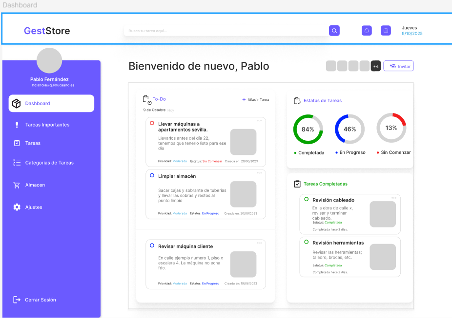
---

## 1.2 Metodología CSS

Uso **BEM (Block Element Modifier)** porque me permite escalar y mantener estilos sin colisiones. Mi convención:

- **Bloques**: .button, .card, .task-card
- **Elementos**: .card__title, .task-card__status-icon, .tabs__panel
- **Modificadores**: .button--primary, .badge--success, .task-card__status-icon--completed

Ejemplos reales de mi código:

```html
<button class="button button--primary button--large">Login</button>
<article class="task-card task-card--hoverable">
  <span class="task-card__status-icon task-card__status-icon--completed"></span>
</article>
```

---

## 1.3 Organización de archivos (ITCSS)

Organizo estilos siguiendo ITCSS, de menor a mayor especificidad, y lo reflejo en src/styles.scss:

```
src/styles/
├── 00-settings/      # Variables y design tokens
├── 01-tools/         # Mixins y funciones
├── 02-generic/       # Reset y estilos genéricos
├── 03-elements/      # Estilos base de elementos HTML
├── 04-objects/       # Layouts y sistemas de grid/flex
├── 05-components/    # Componentes reutilizables
```

Orden de importación (src/styles.scss):
1) Settings → 2) Tools → 3) Generic → 4) Elements → 5) Objects → 6) Components.

Así garantizo que lo más global y reutilizable se aplique primero, y los estilos específicos se sobreescriban de forma controlada al final.

---

## 1.4 Sistema de Design Tokens

Defino los tokens en src/styles/00-settings/_variables.scss y los proyecto a CSS Custom Properties en src/styles/00-settings/_css-variables.scss.

**Colores**
- Primario: $color-primary y su escala ($color-primary-scale).
- Acentos: $color-accent-1..5 y $color-side-menu.
- Neutrales: $gray-50 a $gray-950.
- Semánticos: $success, $error, $warning, $info, $medium.

**Tipografía**
- Familias: $font-primary y $font-secondary.
- Tamaños: $font-size-xs a $font-size-7xl (escala modular).
- Pesos y alturas de línea definidos para consistencia.

**Espaciado**
- Escala modular basada en 4px (0.25rem a 6rem).

**Breakpoints (Desktop First)**
- $breakpoint-xl: 1280px
- $breakpoint-lg: 1024px
- $breakpoint-md: 768px
- $breakpoint-sm: 375px
- $breakpoint-xs: 320px

**Sombras, bordes y radios**
- Sombras: $shadow-sm a $shadow-xl.
- Bordes: $border-thin, $border-medium, $border-thick.
- Radios: $radius-sm, $radius-md, $radius-lg, $radius-xl, $radius-full.

**Decisiones clave**
- Los colores siguen la paleta definida en Figma y garantizan contraste.
- La tipografía modular facilita jerarquía y escalabilidad.
- Los breakpoints cubren móvil, tablet y desktop en una estrategia desktop-first.

---

## 1.5 Mixins y funciones

### Mixins disponibles (src/styles/01-tools/_mixins.scss)
- `respond-down($breakpoint)` / `respond-up($breakpoint)` / `respond-between($lower, $upper)`: responsividad por breakpoint.
- `mobile`, `tablet`, `desktop`: atajos responsive.
- `respond($breakpoint)`: alias desktop-first.
- `text-style($size, $weight, $lh)`: tipografía consistente.
- `focus-visible`: accesibilidad en foco.
- `transition($properties, $duration)`: transiciones suaves.
- `flex-center`, `flex-between`: utilidades flex.
- `truncate`: truncado con ellipsis.
- `absolute-center`: centrado absoluto.
- `theme-transition`, `surface`, `themed-border`, `themed-shadow`: soporte de temas.

Ejemplo real de uso:

```scss
.button {
  @include text-style($font-size-sm, $font-weight-medium);
  @include transition;
  @include respond-down(md) {
    font-size: $font-size-xs;
  }
}
```

### Funciones
- `color-primary($state)` (src/styles/00-settings/_variables.scss) para leer estados del primario.

Ejemplo real de uso (src/styles/03-elements/_typography.scss):

```scss
a {
  color: $interactive-primary;
  @include transition;

  &:hover {
    color: color-primary(normal-hover);
  }
}
```

---

## 1.6 ViewEncapsulation en Angular

Mantengo la estrategia **Emulated** (por defecto en Angular). No configuro `encapsulation` explícitamente en los componentes, por lo que Angular encapsula estilos a nivel de componente. Esto evita fugas de estilos y me da seguridad al escalar.

Si necesito estilos globales, los coloco en src/styles.scss o en utilidades globales, pero el núcleo del sistema vive encapsulado por componente.

# Sección 2: HTML semántico y estructura

## 2.1 Elementos semánticos utilizados

Uso etiquetas semánticas en la estructura principal y en componentes específicos:

- **header**: cabeceras en app-header y home-header.
- **nav**: navegación principal, secundaria y menús (ej. breadcrumbs, header, home-footer).
- **main**: contenedor del contenido principal (app-main).
- **section**: agrupaciones temáticas (hero, secciones de página, bloques de contenido).
- **article**: piezas autocontenidas (cards, task-card, bloques de contenido).
- **aside**: mensajes y feedback (app-alert).
- **footer**: pie de página global y home-footer.
- **figure**: imágenes decorativas y logotipos (home-header, home-footer, login/register).
- **address**: contacto (home-footer y footer).
- **menu**: menús de acciones (task-menu, selector de idioma).
- **form**, **fieldset**, **legend**: estructura de formularios (add-task-modal, login/register).

Ejemplos reales:

```html
<header class="app-header">
  <nav class="app-header__nav" aria-label="Navegación principal">...</nav>
</header>

<main class="app-main">
  <section class="app-main__container o-container">...</section>
</main>

<aside class="alert" role="alert">...</aside>
```

---

## 2.2 Jerarquía de headings

Reglas que sigo:
- Solo un h1 por página.
- h2 para secciones principales.
- h3 para subsecciones.
- No salto niveles.

Diagrama:
```
h1: Título principal
  └─ h2: Sección principal
      └─ h3: Subsección
```

---

## 2.3 Estructura de formularios

Mis formularios están estructurados con form, fieldset y legend, y asocio labels con inputs mediante id/for o wrapping.

Ejemplo real en el modal de tareas:

```html
<form class="add-task-modal__form" (ngSubmit)="onSubmit($event)">
  <fieldset class="add-task-modal__left-column">
    <legend class="visually-hidden">Información de la tarea</legend>
    <label class="add-task-modal__field">
      <span class="add-task-modal__label">Titulo</span>
      <input type="text" class="add-task-modal__input" name="title" required />
    </label>
  </fieldset>
</form>
```

Ejemplo real del componente app-form-input:

```html
<label class="form-group">
  <span class="form-label">{{ label }}</span>
  <input
    [id]="id"
    [name]="name"
    [type]="type"
    class="form-input"
  />
</label>
```

---

# Sección 3: Sistema de componentes UI

## 3.1 Componentes implementados

### Átomos

**app-button**
- Propósito: botón de acción con variantes y tamaños.
- Variantes: primary, secondary, tertiary, outline, danger, success, warning, info, error.
- Tamaños: small, medium, large.
- Estados: disabled, active, fullWidth.
- Ejemplo real (estilos de botón):
```html
<button class="button button--primary button--large">Login</button>
```

**app-badge**
- Propósito: etiqueta de estado/contador.
- Variantes: primary, secondary, success, warning, error, info, default.
- Tamaños: small, medium.
- Estados: sin estados especiales.
- Ejemplo real:
```html
<app-badge variant="success">Success</app-badge>
```

**app-icon**
- Propósito: iconografía con Lucide.
- Variantes: nombres definidos en el mapa (search, bell, calendar, home, star, etc.).
- Tamaños: small, medium, large.
- Estados: sin estados especiales.
- Ejemplo real:
```html
<app-icon name="calendar" size="small"></app-icon>
```

**app-spinner**
- Propósito: indicador de carga.
- Tamaños: small, medium, large.
- Estados: animación `spin`.
- Ejemplo real (markup interno del componente):
```html
<div class="spinner spinner-medium" aria-label="Cargando..."></div>
```

**app-tag**
- Propósito: etiqueta de filtro o categoría.
- Variantes: default, primary, success, warning, error.
- Tamaños: sin tamaños específicos (responsive por CSS).
- Estados: removable (aplica `.tag--removable`).
- Ejemplo real:
```html
<app-tag variant="primary">Primary</app-tag>
```

**app-search-input**
- Propósito: campo de búsqueda con debounce integrado.
- Variantes: no aplica.
- Tamaños: no aplica.
- Estados: focus, hover, con icono de búsqueda.
- Props: placeholder, ariaLabel, debounceMs.
- Ejemplo real:
```html
<app-search-input 
  placeholder="Buscar tareas..." 
  ariaLabel="Buscar" 
  [debounceMs]="300"
  (debouncedSearch)="onSearch($event)">
</app-search-input>
```

---

### Molecules

**app-accordion**
- Propósito: acordeón con soporte teclado.
- Variantes: mode="single" | "multiple".
- Tamaños: no aplica.
- Estados: abierto/cerrado (`is-open`).
- Ejemplo real:
```html
<app-accordion [items]="demoAccordionItems" mode="single"></app-accordion>
```

**app-alert**
- Propósito: feedback de estado.
- Variantes: success, warning, error, info.
- Tamaños: no aplica.
- Estados: closable (botón de cierre), focus/hover.
- Ejemplo real:
```html
<app-alert type="error">Error: No se pudo completar la operación.</app-alert>
```

**app-card**
- Propósito: contenedor de contenido con sombra.
- Variantes: shadow="small|medium|large".
- Tamaños: no aplica.
- Estados: hoverable, variante CSS `.card--horizontal`.
- Ejemplo real:
```html
<app-card shadow="medium" title="Shadow Medium">
  <p>Contenido</p>
</app-card>
```

**app-chart-card**
- Propósito: tarjeta de gráfico con placeholder.
- Variantes: chartType="line|bar|donut|area".
- Tamaños: no aplica.
- Estados: hover.
- Ejemplo real:
```html
<app-chart-card title="Ventas" chartType="line"></app-chart-card>
```

**app-calendar**
- Propósito: calendario interactivo.
- Variantes: no aplica.
- Tamaños: no aplica.
- Estados: día seleccionado, día actual, días fuera de mes.
- Ejemplo real:
```html
<app-calendar (close)="onClose()"></app-calendar>
```

**app-add-task-modal**
- Propósito: modal para crear/editar tareas.
- Variantes: isEditMode.
- Tamaños: no aplica.
- Estados: focus trap, validaciones del formulario.
- Ejemplo real:
```html
<app-add-task-modal [isEditMode]="true" [task]="task"></app-add-task-modal>
```

**app-stat-card**
- Propósito: tarjeta de métrica con icono.
- Variantes: bgColor="primary|success|warning|info|error".
- Tamaños: no aplica.
- Estados: trendType="positive|negative|neutral", hoverable.
- Ejemplo real:
```html
<app-stat-card title="Ventas" value="€9.450" trend="+8%" trendType="positive"></app-stat-card>
```

**app-tabs**
- Propósito: navegación por pestañas.
- Variantes: no aplica.
- Tamaños: no aplica.
- Estados: tab activo (`tabs__tab--active`).
- Ejemplo real:
```html
<app-tabs [tabs]="demoTabs"></app-tabs>
```

**app-task-card**
- Propósito: tarjeta de tarea con estado.
- Variantes: status="completed|pending|in-progress|cancelled".
- Tamaños: no aplica.
- Estados: hoverable, imagen opcional.
- Ejemplo real:
```html
<app-task-card [title]="task.title" [status]="task.status"></app-task-card>
```

**app-task-menu**
- Propósito: menú contextual de acciones.
- Variantes: status (string), isImportant.
- Tamaños: no aplica.
- Estados: hover/focus en items.
- Ejemplo real:
```html
<app-task-menu [status]="task.status" [isImportant]="task.important" (action)="onAction($event)"></app-task-menu>
```

**app-home-header**
- Propósito: header de landing.
- Variantes: no aplica.
- Tamaños: no aplica.
- Estados: menú de idioma abierto/cerrado.
- Ejemplo real:
```html
<app-home-header></app-home-header>
```

**app-home-footer**
- Propósito: footer de landing.
- Variantes: no aplica.
- Tamaños: no aplica.
- Estados: no aplica.
- Ejemplo real:
```html
<app-home-footer></app-home-footer>
```

**app-add-product-modal**
- Propósito: modal para crear/editar productos del almacén.
- Variantes: isEditMode.
- Tamaños: no aplica.
- Estados: validaciones del formulario, isSubmitting.
- Props: product, isEditMode.
- Ejemplo real:
```html
<app-add-product-modal 
  [isEditMode]="true" 
  [product]="product"
  (close)="onClose()"
  (productAdded)="onProductAdded($event)">
</app-add-product-modal>
```

**app-empty-state**
- Propósito: estado vacío cuando no hay elementos que mostrar.
- Variantes: size="default|small".
- Tamaños: default, small.
- Estados: con/sin botón de acción.
- Props: icon, message, buttonText, buttonIcon.
- Ejemplo real:
```html
<app-empty-state 
  icon="inbox" 
  message="No hay tareas" 
  buttonText="Crear tarea"
  (buttonClick)="onCreate()">
</app-empty-state>
```

**app-error-state**
- Propósito: estado de error con opción de reintentar.
- Variantes: no aplica.
- Tamaños: no aplica.
- Estados: showRetry.
- Props: message, showRetry, retryText.
- Ejemplo real:
```html
<app-error-state 
  message="Error al cargar los datos" 
  [showRetry]="true"
  (retry)="onRetry()">
</app-error-state>
```

**app-loading-state**
- Propósito: estado de carga con spinner y mensaje.
- Variantes: spinnerSize="small|medium|large".
- Tamaños: small, medium, large.
- Estados: no aplica.
- Props: message, spinnerSize.
- Ejemplo real:
```html
<app-loading-state 
  message="Cargando tareas..." 
  spinnerSize="medium">
</app-loading-state>
```

**app-modal-wrapper**
- Propósito: wrapper genérico para modales con overlay y accesibilidad.
- Variantes: no aplica.
- Tamaños: no aplica.
- Estados: isOpen.
- Props: isOpen, ariaLabel.
- Ejemplo real:
```html
<app-modal-wrapper 
  [isOpen]="showModal" 
  ariaLabel="Modal de confirmación"
  (close)="onClose()">
  <ng-content></ng-content>
</app-modal-wrapper>
```

**app-product-selector-modal**
- Propósito: modal para seleccionar productos y cantidades.
- Variantes: no aplica.
- Tamaños: no aplica.
- Estados: isLoading, búsqueda activa, selección múltiple.
- Props: selectedProducts.
- Ejemplo real:
```html
<app-product-selector-modal 
  [selectedProducts]="taskProducts"
  (close)="onClose()"
  (productsSelected)="onProductsSelected($event)">
</app-product-selector-modal>
```

**app-stock-notifications**
- Propósito: panel de notificaciones de stock bajo y agotado.
- Variantes: no aplica.
- Tamaños: no aplica.
- Estados: alertas de stock bajo, alertas de agotado.
- Props: no aplica (usa StockAlertService internamente).
- Ejemplo real:
```html
<app-stock-notifications (close)="onCloseNotifications()"></app-stock-notifications>
```

---

### Layout

**app-header**
- Propósito: cabecera global con navegación y theme switcher.
- Variantes: no aplica.
- Tamaños: no aplica.
- Estados: menú móvil abierto/cerrado.
- Ejemplo real:
```html
<app-header></app-header>
```

**app-footer**
- Propósito: pie de página global.
- Variantes: no aplica.
- Tamaños: no aplica.
- Estados: no aplica.
- Ejemplo real:
```html
<app-footer></app-footer>
```

**app-main**
- Propósito: wrapper semántico del contenido.
- Variantes: no aplica.
- Tamaños: no aplica.
- Estados: no aplica.
- Ejemplo real:
```html
<app-main>...</app-main>
```

**app-breadcrumbs**
- Propósito: navegación contextual.
- Variantes: no aplica.
- Tamaños: no aplica.
- Estados: último elemento con aria-current.
- Ejemplo real:
```html
<app-breadcrumbs></app-breadcrumbs>
```

**app-nav-header**
- Propósito: cabecera de navegación con búsqueda, fecha y acciones.
- Variantes: no aplica.
- Tamaños: no aplica.
- Estados: búsqueda activa, notificaciones visibles.
- Props: searchPlaceholder, searchAriaLabel, showSearch, searchValue.
- Ejemplo real:
```html
<app-nav-header 
  searchPlaceholder="Buscar tareas..." 
  [showSearch]="true"
  (debouncedSearchChange)="onSearch($event)"
  (notificationsToggle)="toggleNotifications()"
  (themeToggle)="toggleTheme()">
</app-nav-header>
```

**app-sidebar-layout**
- Propósito: layout con sidebar colapsable y navegación principal.
- Variantes: no aplica.
- Tamaños: no aplica.
- Estados: sidebar abierto/cerrado (responsive), enlace activo.
- Props: activeRoute, showLogout.
- Ejemplo real:
```html
<app-sidebar-layout [activeRoute]="'/dashboard'" [showLogout]="true">
  <ng-content></ng-content>
</app-sidebar-layout>
```

---

### Shared

**app-form-input**
- Propósito: input de texto con label, help y error.
- Variantes: type (text, email, password, etc.).
- Tamaños: no aplica.
- Estados: error, disabled, required, focus.
- Ejemplo real:
```html
<app-form-input id="email" name="email" label="Email" type="email"></app-form-input>
```

**app-form-select**
- Propósito: select accesible.
- Variantes: options.
- Tamaños: no aplica.
- Estados: error, disabled, required.
- Ejemplo real:
```html
<app-form-select id="role" name="role" [options]="roles"></app-form-select>
```

**app-form-textarea**
- Propósito: textarea accesible.
- Variantes: rows.
- Tamaños: no aplica.
- Estados: error, disabled, required.
- Ejemplo real:
```html
<app-form-textarea id="desc" name="desc" rows="6"></app-form-textarea>
```

**app-login-form**
- Propósito: formulario de login.
- Variantes: no aplica.
- Tamaños: no aplica.
- Estados: loading, errores de validación.
- Ejemplo real:
```html
<app-login-form></app-login-form>
```

**app-register-form**
- Propósito: formulario de registro.
- Variantes: no aplica.
- Tamaños: no aplica.
- Estados: loading, errores de validación.
- Ejemplo real:
```html
<app-register-form></app-register-form>
```

**app-notification-container**
- Propósito: contenedor de notificaciones toast globales.
- Variantes: no aplica (hereda variantes de app-alert: success, warning, error, info).
- Tamaños: no aplica.
- Estados: múltiples notificaciones apiladas, animación de entrada/salida.
- Props: no aplica (usa NotificationService internamente).
- Ejemplo real:
```html
<!-- Se incluye una vez en el componente raíz (app.component) -->
<app-notification-container></app-notification-container>

<!-- Uso desde cualquier componente vía servicio -->
<!-- this.notificationService.success('Tarea creada correctamente'); -->
<!-- this.notificationService.error('Error al guardar'); -->
```

---

## 3.2 Nomenclatura y metodología

Ejemplos reales de BEM en mis componentes:

- **Block**: `.button`
- **Element**: `.task-card__status-icon`
- **Modifier**: `.button--primary`, `.task-card__status-icon--completed`

Ejemplos en código:

```html
<button class="button button--primary button--small"></button>
<span class="task-card__status-icon task-card__status-icon--completed"></span>
<nav class="app-header__nav app-header__nav--mobile"></nav>
```

Estrategia:
- Uso **block** para el componente principal.
- Uso **element** para piezas internas del bloque.
- Uso **modifier** para variaciones visuales o estados (color, tamaño, activo).

---

## 3.3 Style Guide

He creado la página de Style Guide en src/app/pages/style-guide, donde documento visualmente componentes, colores y tipografía. Me sirve como referencia visual, validación rápida y testing manual de estados.

Style Guide:
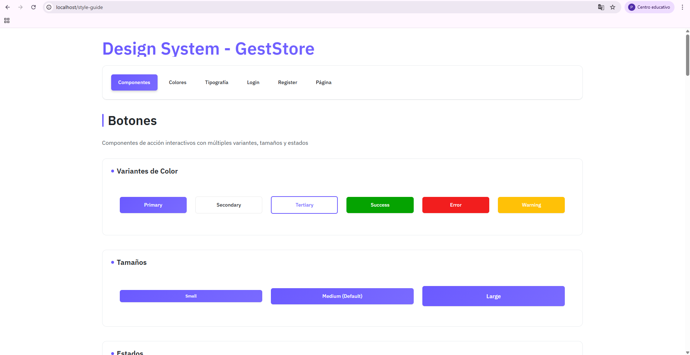

---

# Sección 4: Responsive design

## 4.1 Breakpoints definidos

Defino los breakpoints en src/styles/00-settings/_variables.scss:

- xs: 320px
- sm: 375px
- md: 768px
- lg: 1024px
- xl: 1280px

Justificación: cubro móvil pequeño, móvil estándar, tablet, laptop y desktop, con estrategia desktop-first.

---

## 4.2 Estrategia responsive

Uso **desktop-first** con mixins `respond-down` para adaptar hacia tamaños menores. Ejemplo real en el header:

```scss
.app-header__nav--desktop {
  display: flex;
  @include respond-down(lg) {
    display: none;
  }
}
```

---

## 4.3 Container Queries

Implementé Container Queries en el componente app-card para adaptar el layout por tamaño del contenedor, no del viewport:

```scss
.card {
  container-type: inline-size;
  container-name: card;
}

@container card (max-width: 400px) {
  .card__body { padding: $spacing-2; }
}
```

---

## 4.4 Adaptaciones principales

| Componente | Mobile (≤ 375px) | Tablet (768px) | Desktop (≥ 1024px) |
|---|---|---|---|
| Header | Menú hamburguesa, nav móvil desplegable | Nav desktop oculto, acciones compactas | Nav desktop visible, acciones completas |
| Card | Padding reducido y tipografía más pequeña | Padding medio | Padding completo y sombras | 
| Task Card | Layout en columna, thumbnail arriba | Layout con gap reducido | Layout en fila con thumbnail lateral |
| Botones | Padding menor y tamaños compactos | Ajuste intermedio | Padding y tamaño estándar |

---

## 4.5 Páginas responsive implementadas

- Dashboard
- Tasks
- Task Detail
- Task Edit
- Important Tasks
- Profile
- Settings
- Style Guide
- Not Found

---

## 4.6 Screenshots comparativos

Dashboard
- Mobile (375px):
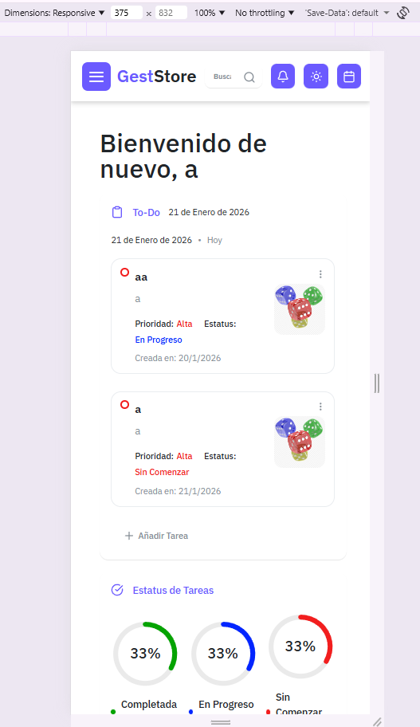
- Tablet (768px):
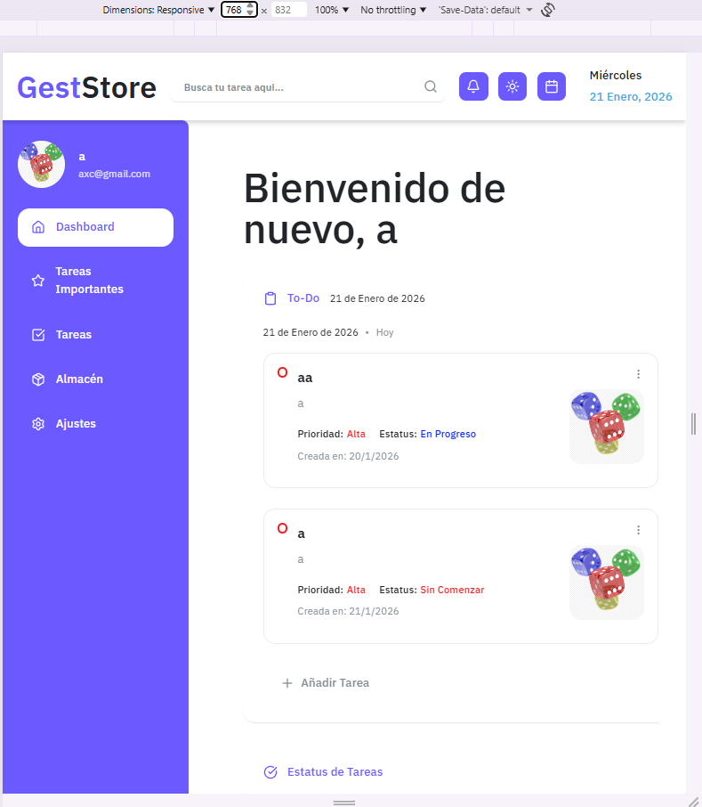
- Desktop (1280px):
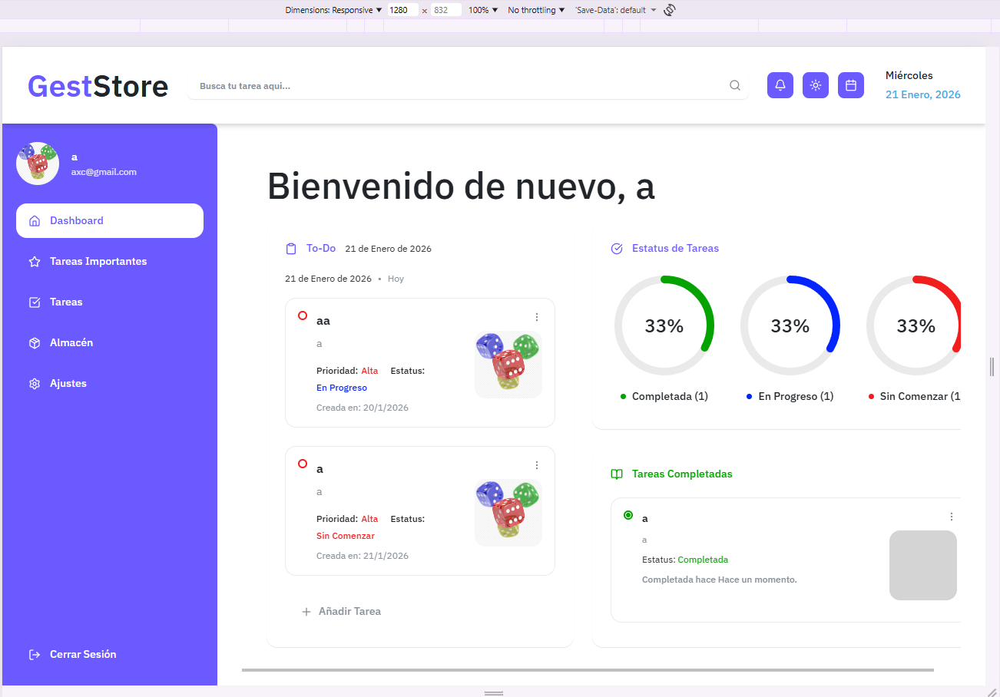

Tasks
- Mobile (375px):
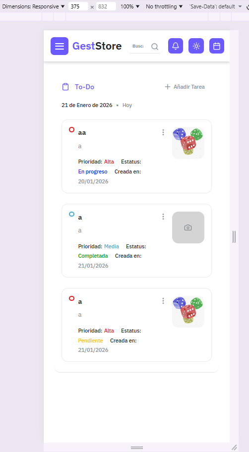
- Tablet (768px):
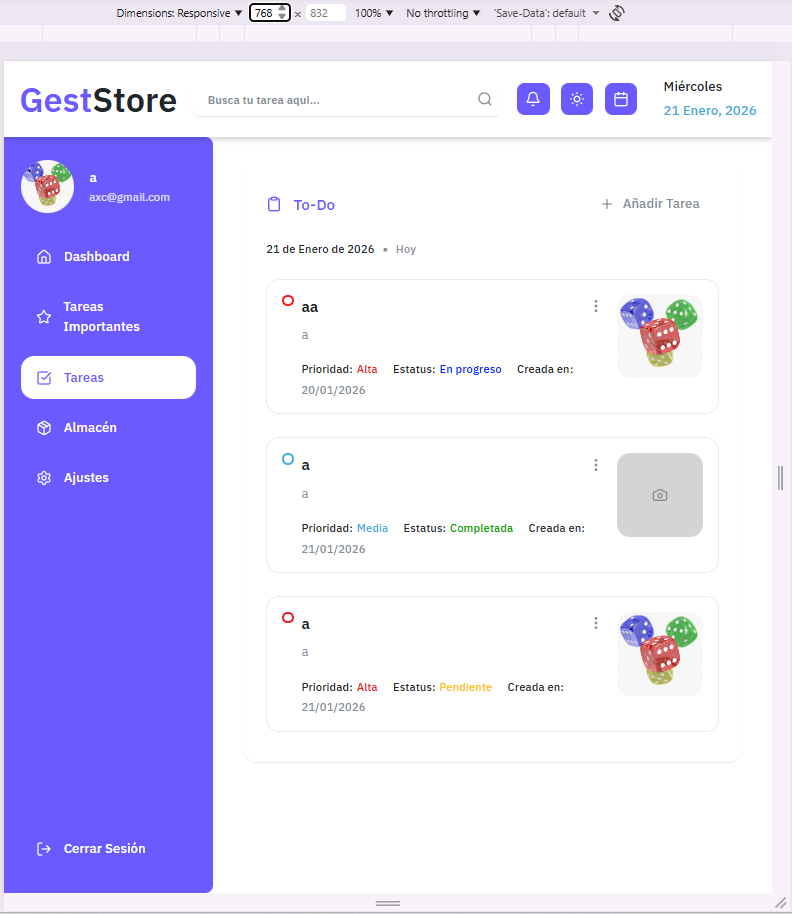
- Desktop (1280px):
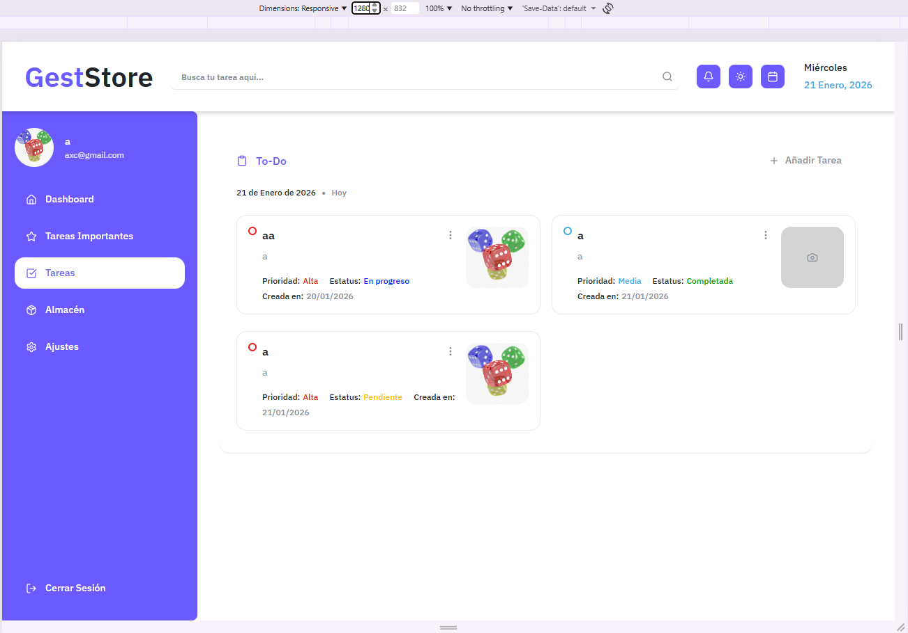

Profile
- Mobile (375px): 
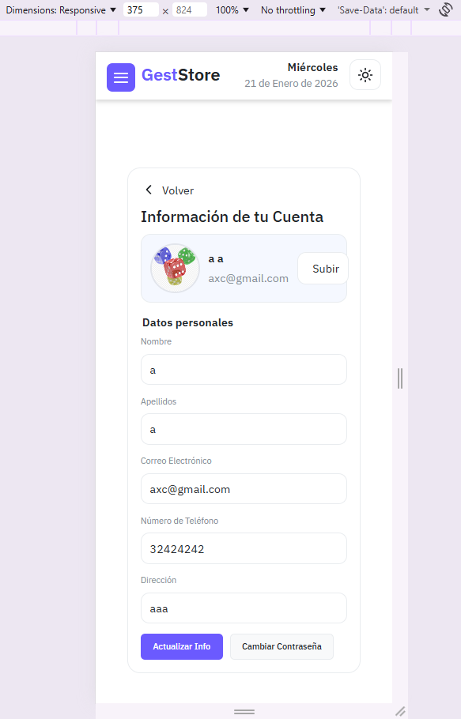
- Tablet (768px): 
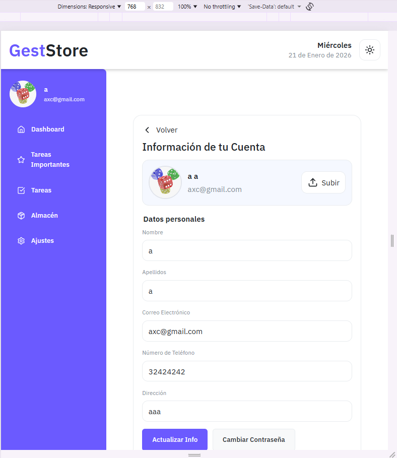
- Desktop (1280px):
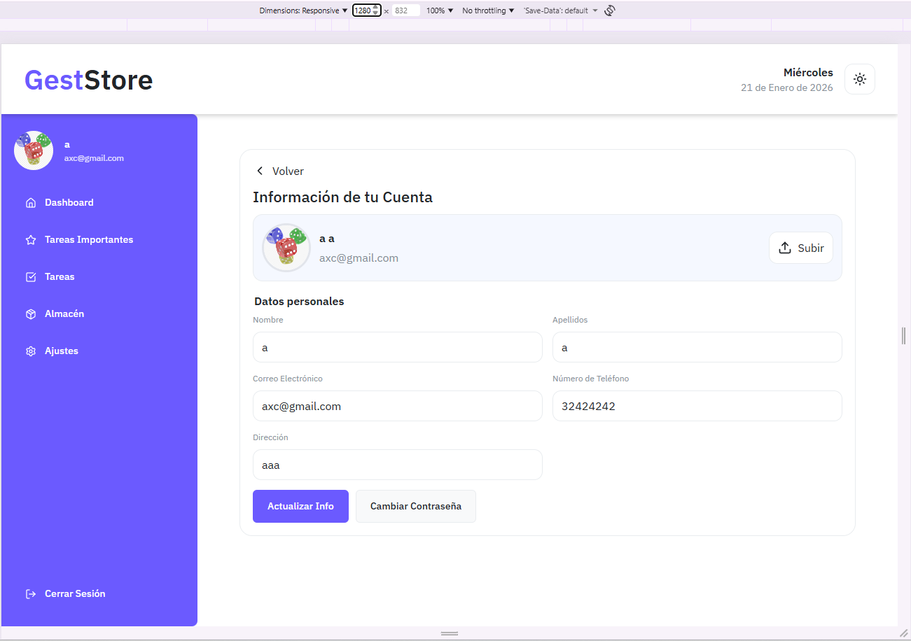

---

# Sección 5: Optimización multimedia

## 5.1 Formatos elegidos

Mi formato era PNG, y voy a elegir transformar a JPG, ese será el formato que usaré en mi proyecto.

---

## 5.2 Herramientas utilizadas

Squoosh

---

## 5.3 Resultados de optimización

He transformado las imagenes que anteriormente eran PNG a WEBP, y optimizado las mismas:

| Imagen | Tamaño original | Imagen actualizada | Tamaño optimizado | % reducción |
|---|---:|---:|---:|---:|
| public/login-illustration.png | 42.1 KB | public/login-illustration.webp | 7.71 KB | 	81.7% |
| public/register-illustration.png | 37.9 KB | public/register-illustration.webp | 12.8 KB | 66.2% |

Las imagenes de las mismas pero en 400 y 800 pixeles han sido obtenidas directamente optimizadas al reajustarlas en el software Squoosh, tambien en webp por lo que no es necesario añadirlas a la tabla.

---

## 5.4 Tecnologías implementadas

**loading="lazy"** y **decoding="async"** se usan en imágenes como las ilustraciones de login y register, y además he implementado **`<picture>`**, **`srcset`** y **`sizes`** para servir el recurso adecuado según el viewport.

Ejemplo real (login/register):

```html
<picture>
  <source
    type="image/webp"
    srcset="login-illustration.webp 600w, /assets/images/login/login-illustration.webp 1200w"
    sizes="(max-width: 768px) 100vw, 600px"
  />
  
</picture>
```

---

## 5.5 Animaciones CSS

Las animaciones viven en src/styles/05-components/_animations.scss y solo usan **transform** y **opacity** para rendimiento.

Listado principal:
- spin (spinner)
- fadeIn, fadeInUp, fadeInDown
- bounce, bounceIn
- slideInLeft, slideInRight
- pulse, pulseGlow
- scaleIn, scaleOut
- shake
- shimmer (skeleton)
- utilidades: transition-*, hover-*, focus-*

Ejemplo real:

```scss
@keyframes fadeInUp {
  from { opacity: 0; transform: translateY(20px); }
  to { opacity: 1; transform: translateY(0); }
}
```

---

# Sección 6: Sistema de temas

## 6.1 Variables de tema

Uso CSS Custom Properties para light/dark en src/styles/00-settings/_css-variables.scss:

```scss
:root {
  --bg-default: #{$bg-default};
  --text-default: #{$text-default};
  --color-primary: #{$color-primary};
}

[data-theme='dark'] {
  --bg-default: #{$gray-950};
  --text-default: #{$gray-50};
}
```

---

## 6.2 Implementación del Theme Switcher

Inicializo el tema en app.ts y lo alterno desde el header con ThemeService:

```typescript
constructor(private themeService: ThemeService) {
  this.themeService.init();
}
```

```typescript
toggleTheme(): void {
  this.themeService.toggle();
}
```

El servicio guarda la preferencia en localStorage y aplica `data-theme` en `documentElement`.

---

## 6.3 Capturas de pantalla

Modo claro / oscuro (3 páginas):
- Dashboard: 

Claro:

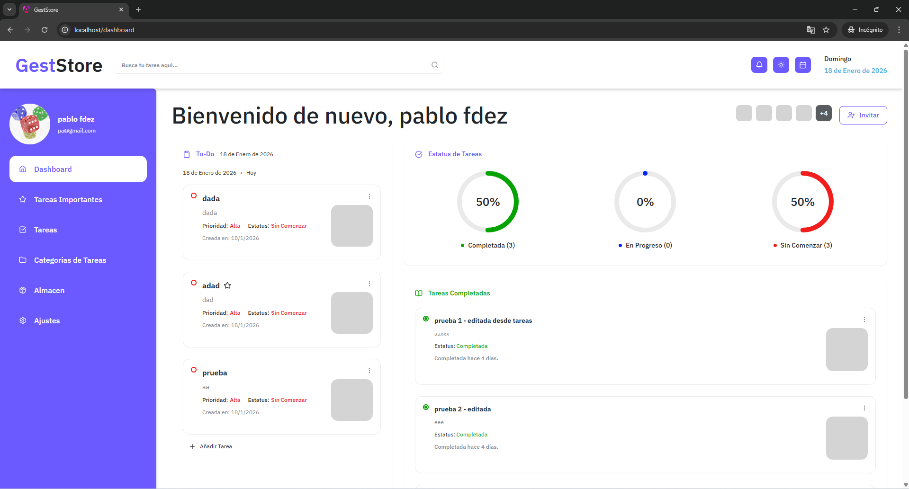

Oscuro:

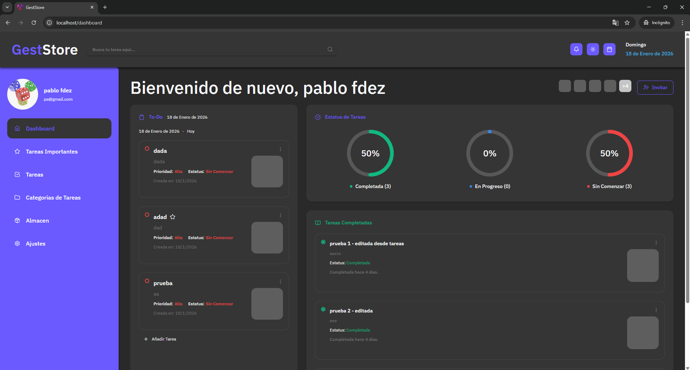

- Tasks:

Claro:

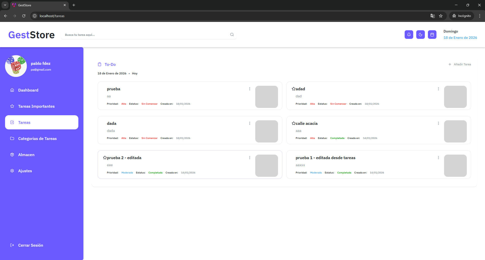

Oscuro:

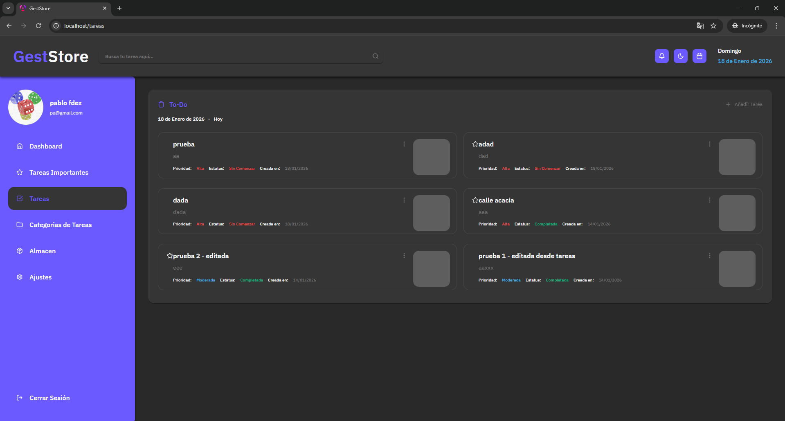

- Profile:

Claro:

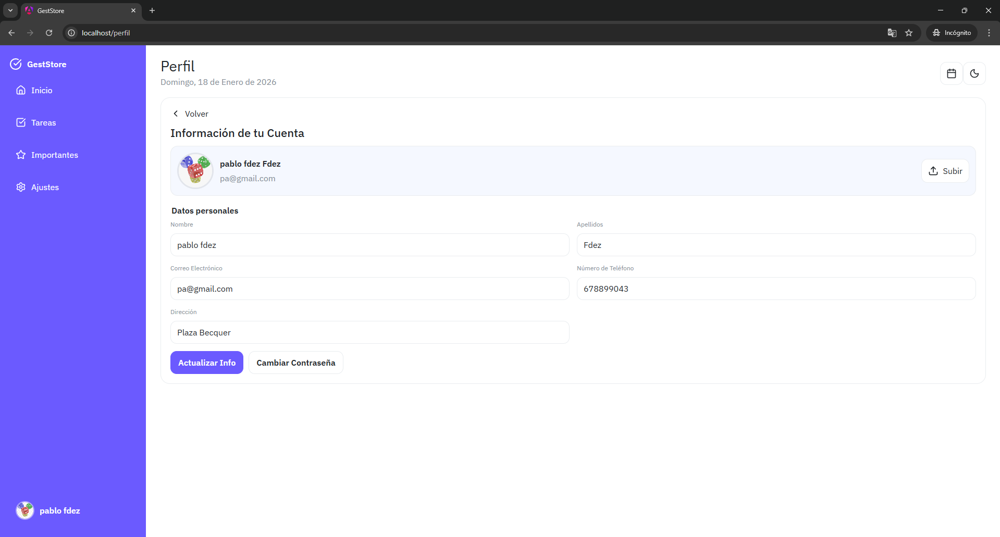

Oscuro:

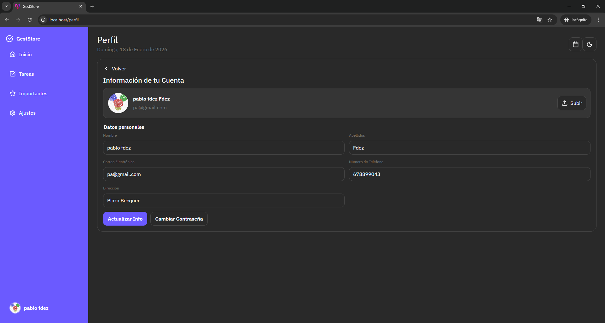


---

# Sección 7: Aplicación completa y despliegue

## 7.1 Estado final de la aplicación

### Páginas implementadas

| Página | Ruta | Descripción | Estado |
|--------|------|-------------|--------|
| **Home** | `/` | Landing page con presentación del producto | ✅ Completa |
| **Dashboard** | `/dashboard` | Panel principal con resumen de tareas, estadísticas y accesos rápidos | ✅ Completa |
| **Tasks** | `/tasks` | Listado de tareas con filtros, búsqueda y paginación | ✅ Completa |
| **Task Detail** | `/tasks/:id` | Vista detallada de una tarea con productos asociados | ✅ Completa |
| **Task Edit** | `/tasks/:id/edit` | Edición de tarea existente | ✅ Completa |
| **Important Tasks** | `/important` | Tareas marcadas como importantes/favoritas | ✅ Completa |
| **Warehouse** | `/warehouse` | Gestión de inventario y productos | ✅ Completa |
| **Profile** | `/profile` | Perfil de usuario con estadísticas | ✅ Completa |
| **Settings** | `/settings` | Configuración de la aplicación | ✅ Completa |
| **Style Guide** | `/style-guide` | Guía de estilos y componentes UI | ✅ Completa |
| **Not Found** | `**` | Página 404 para rutas no encontradas | ✅ Completa |

### Funcionalidades implementadas

| Funcionalidad | Descripción | Estado |
|---------------|-------------|--------|
| **Autenticación** | Login/registro con JWT y refresh tokens | ✅ |
| **CRUD Tareas** | Crear, leer, actualizar y eliminar tareas | ✅ |
| **CRUD Productos** | Gestión completa de productos en almacén | ✅ |
| **Asignación de productos** | Vincular productos a tareas con cantidades | ✅ |
| **Filtros avanzados** | Filtrar por estado, prioridad, fechas | ✅ |
| **Búsqueda** | Búsqueda en tiempo real con debounce | ✅ |
| **Paginación** | Navegación por páginas en listados | ✅ |
| **Scroll infinito** | Carga progresiva de contenido | ✅ |
| **Favoritos** | Marcar tareas como importantes | ✅ |
| **Tema claro/oscuro** | Cambio de tema con persistencia | ✅ |
| **Notificaciones toast** | Sistema de notificaciones visuales | ✅ |
| **Responsive design** | Adaptación a móvil (375px), tablet y desktop | ✅ |
| **Guards de ruta** | Protección de rutas autenticadas | ✅ |
| **Interceptors HTTP** | Manejo de tokens y errores | ✅ |
| **Estados de carga** | Loading, empty y error states | ✅ |

---

## 7.2 Despliegue

### URL de producción


https://satisfactory-chandra-geststore-0b06e3cf.koyeb.app/

### Verificación de funcionamiento

| Verificación | Estado |
|--------------|--------|
| Carga inicial de la aplicación | ✅ Funcional |
| Login y autenticación | ✅ Funcional |
| Navegación entre páginas | ✅ Funcional |
| CRUD de tareas | ✅ Funcional |
| CRUD de productos | ✅ Funcional |
| Cambio de tema | ✅ Funcional |
| Responsive en móvil | ✅ Funcional |
| HTTPS habilitado | ✅ Activo |
| Compresión gzip | ✅ Activo |

### Configuración de despliegue


---

## 7.3 Problemas conocidos y mejoras futuras

### Problemas conocidos

| Problema | Severidad | Descripción |
|----------|-----------|-------------|
| Falta de desarrollo | Media | Falta la implementación de la funcion de agregar trabajadores y de las categorias |

### Mejoras futuras

| Mejora | Prioridad | Descripción |
|--------|-----------|-------------|
| **PWA** | Alta | Convertir en Progressive Web App con offline support |
| **Drag & Drop** | Media | Reordenar tareas arrastrando |
| **Exportar a PDF** | Baja | Generar informes de tareas en PDF |
| **Internacionalización** | Baja | Soporte multi-idioma (i18n) |
| **Colaboración** | Alta | Asignar tareas a múltiples usuarios |
| **Historial de cambios** | Baja | Log de modificaciones por tarea |
| **Optimización imágenes** | Media | Conversión automática a WebP con fallbacks |

---

## 7.4 Conclusiones

GestStore es una aplicación web completa de gestión de tareas y almacén desarrollada con:

- **Frontend**: Angular 19+ con componentes standalone, SCSS modular (ITCSS + BEM)
- **Backend**: Spring Boot 3 con API REST y autenticación JWT
- **Base de datos**: MongoDB
- **Despliegue**: Docker + Koyeb

La aplicación cumple con los requisitos de diseño responsivo, accesibilidad básica, sistema de temas y arquitectura modular, proporcionando una experiencia de usuario consistente en todos los dispositivos.